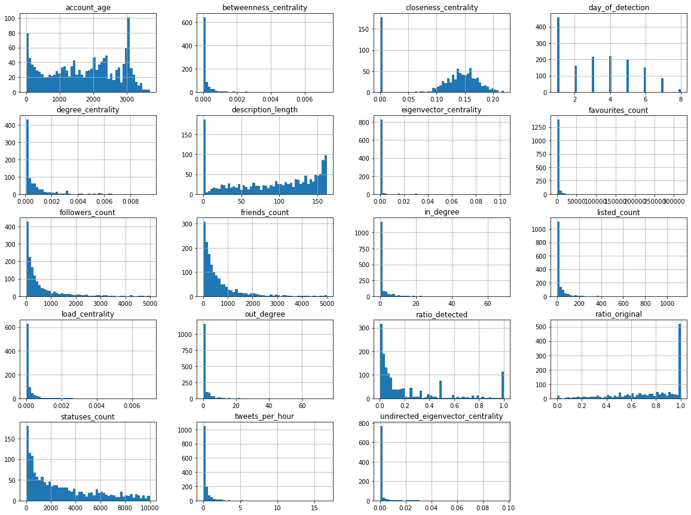
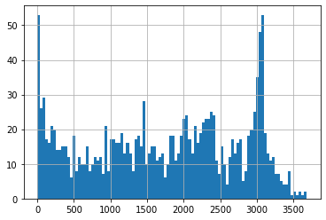
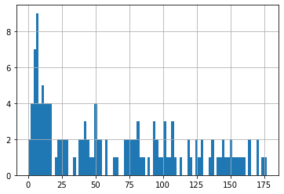

# User Location Classification in Hurricane Harvey
The goal of this analysis is to evaluate methods by which users Tweeting about Hurricane Harvey may be classified as in the area or otherwise.

Data was collected ......


```python
import pandas as pd
path = 'data/harvey_user_location/cleaned_users_df.csv'

users_df = pd.read_csv(path, index_col=0) 
#users_df = users_df.drop(['Unnamed: 0.1'], axis=1)

users_df.shape
```


    (1499, 50)


## Data Verification and Splitting


```python
%matplotlib inline

cols_to_drop = ['id', 'user_id']

# Ignore binary columns:
for col in users_df.columns:
    if len(users_df[col].value_counts()) == 2:
        cols_to_drop += [col]

users_df.drop(cols_to_drop, axis=1).hist(bins=50, figsize=(20,15));

```





##### Notes: 
* account_age has many low values, which may be an error in the age calculation or may simply suggest input from newly created accounts. This could be due to users creating accounts specifically to talk about the event, or bot traffic where bots are likely to be detected and removed over time so they are not represented at larger age values. Need to investigate further.
* account_age has a spike of accounts created around 3000 days prior to the event. This could also be an error in data collection, or could represent a significant event in Twitter's history.
* day_of_detection represents the earliest day an account is detected, so even where behaviour is constant, we expect to see a decrease in these values as accounts are detected a second time. There is a large amount of accounts detected at day=1, which could be an error in the collection or calculation. To be checked.
* ratio_detected has spikes at expected increments: 1, 1/2, 1/3, 1/4 - these are more common as low Tweet count is more common.


```python
# Look closer at account_age:
users_df['account_age'].hist(bins=100);
```





The spike at age=3000 appears natural, so is less likely to be a calculation/collection error. Now we can look at the most recent account ages in more detail:


```python
# Histogram of accounts made in the last 6 months:
users_df['account_age'].loc[users_df['account_age'] < 180].hist(bins=90);
```





There is a clear spike in accounts made up to 20 days prior to the end of the data collection. This may be consistent with regular Twitter usage as bots are recreated, or users may make accounts to participate in the hurricane discussion. This could be compared to a random Twitter stream in future work.

In any case, it does not appear to be a collection error.

Note: the date from which this age was calculated was approximately 7 days after the hurricane made landfall.


```python
# Stratification to ensure proportional representation of class in test set:
# Set category:
# users_df['strat'] = pd.cut(users_df['to_strat'], bins=[0,1.5,2.5, np.inf], labels=[1,2,3])
# Then split with StratifiedShuffleSplit
```


```python
# Display all columns of DF in cell:
pd.set_option('display.max_columns', None)

# Check available columns
users_df.columns
```


    Index(['added_at', 'betweenness_centrality', 'closeness_centrality',
           'created_at', 'default_profile', 'default_profile_image',
           'degree_centrality', 'description', 'eigenvector_centrality',
           'favourites_count', 'followers_count', 'friends_count', 'geo_enabled',
           'has_extended_profile', 'id', 'in_degree', 'is_translation_enabled',
           'listed_count', 'load_centrality', 'location', 'name',
           'old_screen_name', 'out_degree', 'ratio_detected', 'ratio_original',
           'screen_name', 'statuses_count', 'tweets_per_hour',
           'undirected_eigenvector_centrality', 'url', 'user_id', 'verified',
           'local_profile_location', 'local_timezone', 'coded_as_witness',
           'tweet_from_locality', 'three_local_metrics',
           'local_tw_and_local_profile', 'local_tw_and_local_tz',
           'local_tz_and_local_profile', 'description_length', 'lang_is_en',
           'has_translator_type', 'has_url', 'changed_screen_name', 'account_age',
           'day_of_detection', 'is_user_class_2', 'is_data_source_1',
           'is_data_source_3'],
          dtype='object')


Columns which are not relevant to the classification problem are dropped, and the test and train partitions are created. 

The column 'local_profile_location_manual' is removed as 'local_profile_location' is preferred for scalability.

Any remaining NAN values are also filled with zeroes. 

The dataframe is also checked for any columns that were not cleaned appropriately (for example, still True/False rather than 1/0)


```python
from sklearn.model_selection import train_test_split

# Excluded features:
dropped_cols = ['added_at', 'description', 'created_at', 'id',  'location', 'name', 'url', 
                'screen_name', 'user_id', 'coded_as_witness', 'old_screen_name']

xVar = users_df.drop(dropped_cols, axis=1)

yVar = users_df['coded_as_witness']

# Partition data sets:
xVar = xVar.fillna(0)
X_train, X_test, y_train, y_test = train_test_split(xVar, yVar, test_size=0.2, random_state=42)
print (X_train.shape, y_train.shape)
print (X_test.shape, y_test.shape)

X_train.head()
```

    (1199, 39) (1199,)
    (300, 39) (300,)


<div>
<table border="1" class="dataframe">
  <thead>
    <tr style="text-align: right;">
      <th></th>
      <th>betweenness_centrality</th>
      <th>closeness_centrality</th>
      <th>default_profile</th>
      <th>default_profile_image</th>
      <th>degree_centrality</th>
      <th>eigenvector_centrality</th>
      <th>favourites_count</th>
      <th>followers_count</th>
      <th>friends_count</th>
      <th>geo_enabled</th>
      <th>has_extended_profile</th>
      <th>in_degree</th>
      <th>is_translation_enabled</th>
      <th>listed_count</th>
      <th>load_centrality</th>
      <th>out_degree</th>
      <th>ratio_detected</th>
      <th>ratio_original</th>
      <th>statuses_count</th>
      <th>tweets_per_hour</th>
      <th>undirected_eigenvector_centrality</th>
      <th>verified</th>
      <th>local_profile_location</th>
      <th>local_timezone</th>
      <th>tweet_from_locality</th>
      <th>three_local_metrics</th>
      <th>local_tw_and_local_profile</th>
      <th>local_tw_and_local_tz</th>
      <th>local_tz_and_local_profile</th>
      <th>description_length</th>
      <th>lang_is_en</th>
      <th>has_translator_type</th>
      <th>has_url</th>
      <th>changed_screen_name</th>
      <th>account_age</th>
      <th>day_of_detection</th>
      <th>is_user_class_2</th>
      <th>is_data_source_1</th>
      <th>is_data_source_3</th>
    </tr>
  </thead>
  <tbody>
    <tr>
      <th>383</th>
      <td>0.000705</td>
      <td>0.187359</td>
      <td>0</td>
      <td>0</td>
      <td>0.001397</td>
      <td>2.397852e-04</td>
      <td>708</td>
      <td>3039</td>
      <td>1011</td>
      <td>1</td>
      <td>0</td>
      <td>10</td>
      <td>0</td>
      <td>107</td>
      <td>0.000725</td>
      <td>3</td>
      <td>0.076923</td>
      <td>0.769231</td>
      <td>6086</td>
      <td>0.073456</td>
      <td>0.000708</td>
      <td>0</td>
      <td>0</td>
      <td>1</td>
      <td>0</td>
      <td>0</td>
      <td>0</td>
      <td>0</td>
      <td>0</td>
      <td>148</td>
      <td>1</td>
      <td>0</td>
      <td>1</td>
      <td>0</td>
      <td>3158</td>
      <td>5</td>
      <td>0</td>
      <td>1</td>
      <td>0</td>
    </tr>
    <tr>
      <th>539</th>
      <td>0.000000</td>
      <td>0.000000</td>
      <td>0</td>
      <td>0</td>
      <td>0.000000</td>
      <td>0.000000e+00</td>
      <td>1188</td>
      <td>115</td>
      <td>299</td>
      <td>1</td>
      <td>1</td>
      <td>0</td>
      <td>0</td>
      <td>9</td>
      <td>0.000000</td>
      <td>0</td>
      <td>0.040000</td>
      <td>0.600000</td>
      <td>2688</td>
      <td>0.141262</td>
      <td>0.000000</td>
      <td>0</td>
      <td>1</td>
      <td>0</td>
      <td>1</td>
      <td>0</td>
      <td>1</td>
      <td>0</td>
      <td>0</td>
      <td>58</td>
      <td>1</td>
      <td>0</td>
      <td>0</td>
      <td>0</td>
      <td>828</td>
      <td>5</td>
      <td>0</td>
      <td>0</td>
      <td>1</td>
    </tr>
    <tr>
      <th>1493</th>
      <td>0.000000</td>
      <td>0.000000</td>
      <td>1</td>
      <td>0</td>
      <td>0.000000</td>
      <td>0.000000e+00</td>
      <td>56</td>
      <td>42</td>
      <td>361</td>
      <td>0</td>
      <td>1</td>
      <td>0</td>
      <td>0</td>
      <td>0</td>
      <td>0.000000</td>
      <td>0</td>
      <td>0.032258</td>
      <td>0.870968</td>
      <td>840</td>
      <td>0.175165</td>
      <td>0.000000</td>
      <td>0</td>
      <td>0</td>
      <td>0</td>
      <td>0</td>
      <td>0</td>
      <td>0</td>
      <td>0</td>
      <td>0</td>
      <td>104</td>
      <td>0</td>
      <td>0</td>
      <td>0</td>
      <td>0</td>
      <td>408</td>
      <td>1</td>
      <td>0</td>
      <td>1</td>
      <td>0</td>
    </tr>
    <tr>
      <th>1113</th>
      <td>0.000000</td>
      <td>0.000000</td>
      <td>1</td>
      <td>0</td>
      <td>0.000000</td>
      <td>0.000000e+00</td>
      <td>7</td>
      <td>50</td>
      <td>5</td>
      <td>0</td>
      <td>0</td>
      <td>0</td>
      <td>0</td>
      <td>11</td>
      <td>0.000000</td>
      <td>0</td>
      <td>0.005319</td>
      <td>0.867021</td>
      <td>5382</td>
      <td>1.062289</td>
      <td>0.000000</td>
      <td>0</td>
      <td>0</td>
      <td>0</td>
      <td>0</td>
      <td>0</td>
      <td>0</td>
      <td>0</td>
      <td>0</td>
      <td>68</td>
      <td>1</td>
      <td>0</td>
      <td>0</td>
      <td>0</td>
      <td>780</td>
      <td>2</td>
      <td>0</td>
      <td>1</td>
      <td>0</td>
    </tr>
    <tr>
      <th>325</th>
      <td>0.000000</td>
      <td>0.000000</td>
      <td>1</td>
      <td>0</td>
      <td>0.000061</td>
      <td>1.764451e-52</td>
      <td>39</td>
      <td>7</td>
      <td>57</td>
      <td>0</td>
      <td>1</td>
      <td>0</td>
      <td>0</td>
      <td>0</td>
      <td>0.000000</td>
      <td>1</td>
      <td>0.071429</td>
      <td>0.857143</td>
      <td>75</td>
      <td>0.079107</td>
      <td>0.000239</td>
      <td>0</td>
      <td>0</td>
      <td>0</td>
      <td>0</td>
      <td>0</td>
      <td>0</td>
      <td>0</td>
      <td>0</td>
      <td>127</td>
      <td>1</td>
      <td>0</td>
      <td>0</td>
      <td>1</td>
      <td>17</td>
      <td>5</td>
      <td>0</td>
      <td>1</td>
      <td>0</td>
    </tr>
  </tbody>
</table>
</div>


## Data Exploration
Check for linear correlations:


```python
# Create copy of training data to investigate
df = X_train.copy()
df['coded_as_witness'] = y_train

corr_matrix = df.corr()
corr_matrix['coded_as_witness'].sort_values(ascending=False)
```


    coded_as_witness                     1.000000
    local_profile_location               0.551050
    local_tw_and_local_profile           0.437055
    tweet_from_locality                  0.424988
    is_data_source_3                     0.424988
    local_tz_and_local_profile           0.296873
    local_tw_and_local_tz                0.268485
    ratio_detected                       0.259706
    three_local_metrics                  0.253538
    geo_enabled                          0.249082
    closeness_centrality                 0.170760
    ratio_original                       0.138819
    local_timezone                       0.138634
    lang_is_en                           0.132348
    has_extended_profile                 0.116959
    betweenness_centrality               0.115513
    load_centrality                      0.115172
    degree_centrality                    0.114462
    account_age                          0.093229
    undirected_eigenvector_centrality    0.041267
    changed_screen_name                  0.033872
    in_degree                            0.029015
    favourites_count                     0.019936
    friends_count                        0.003855
    out_degree                           0.003253
    eigenvector_centrality               0.001058
    is_translation_enabled              -0.005134
    verified                            -0.014884
    has_url                             -0.019378
    default_profile                     -0.021911
    has_translator_type                 -0.023297
    followers_count                     -0.037975
    default_profile_image               -0.049895
    statuses_count                      -0.050996
    is_user_class_2                     -0.076615
    description_length                  -0.079136
    tweets_per_hour                     -0.081751
    listed_count                        -0.092858
    day_of_detection                    -0.166594
    is_data_source_1                    -0.396794
    Name: coded_as_witness, dtype: float64


We can use scatterplot visualisations to detect correlations.


```python
import matplotlib.pyplot as plt

column_list = [x for x in df.columns if len(df[x].value_counts()) != 2]

fig, axes = plt.subplots(len(column_list), figsize=( 6.4, 4.8*len(column_list) ))
for idx, col in enumerate(column_list):
    axes[idx].scatter(df[col], df['coded_as_witness'], alpha=0.1)
    axes[idx].title.set_text(col)
```


## Classification

The data is now ready for classification. Random forests will be used initially and will suit the relatively small dataset. These will be compared to XGBoost models.


```python
from sklearn.metrics import precision_score, recall_score

def get_results(clf, X_train, y_train, X_test, y_test):
    # Evaluate Training Data
    pred_train = clf.predict(X_train)
    errors_train = sum(abs(pred_train - y_train))
    train_acc = round((1 - errors_train/len(pred_train)) * 100, 2)
    print('Accuracy on Training Data:', train_acc, '%.')
    # Evaluate Test Data
    pred = clf.predict(X_test)
    errors = sum(abs(pred - y_test))
    test_acc = round((1 - errors/len(pred)) * 100, 2)
    print('Accuracy on Test Data:', test_acc, '%.')
    # Evaluate AUC Score
    auc_score = round(roc_auc_score(y_test, pred), 2)
    print('AUC score: ', auc_score)
    # Confusion Matrix:
    print(pd.crosstab(y_test, pred, rownames=['Actual Result'], colnames=['Predicted Result']))
    # Evaluate Precision & Recall:
    prec = round(precision_score(y_test, pred), 2)
    recall = round(recall_score(y_test, pred), 2)
    return(train_acc, test_acc, auc_score, prec, recall)
```


```python
#from sklearn.metrics import roc_auc_score

results_df = pd.DataFrame(columns=['model', 'train_acc', 'test_acc', 'auc', 'precision', 'recall'])
```

### Logistic Regression
Logistic Regression using single variable:


```python
from sklearn.linear_model import LogisticRegression
X_train_single = X_train.drop([x for x in X_train.columns if x != 'local_profile_location'], axis=1)
X_test_single = X_test.drop([x for x in X_train.columns if x != 'local_profile_location'], axis=1)
clf = LogisticRegression(random_state=0).fit(X_train_single, y_train)
#clf.score(X_train_single, y_train)

results_df.loc[len(results_df)] = ['logr_localprofile'] + list(get_results(clf, X_train_single, y_train, X_test_single, y_test))
```

    Accuracy on Training Data: 83.15 %.
    Accuracy on Test Data: 78.0 %.
    AUC score:  0.74
    Predicted Result    0   1
    Actual Result            
    0                 182  38
    1                  28  52


```python
X_train_single = X_train.drop([x for x in X_train.columns if x != 'tweet_from_locality'], axis=1)
X_test_single = X_test.drop([x for x in X_train.columns if x != 'tweet_from_locality'], axis=1)
clf = LogisticRegression(random_state=0).fit(X_train_single, y_train)
#clf.score(X_train_single, y_train)

results_df.loc[len(results_df)] = ['logr_localtweet'] + list(get_results(clf, X_train_single, y_train, X_test_single, y_test))
```

    Accuracy on Training Data: 76.9 %.
    Accuracy on Test Data: 76.67 %.
    AUC score:  0.75
    Predicted Result    0   1
    Actual Result            
    0                 174  46
    1                  24  56


Logistic Regression using all variables


```python
from sklearn.linear_model import LogisticRegression
#.drop([x for x in X_train.columns if x != 'local_profile_location'], axis=1)
clf = LogisticRegression(random_state=0).fit(X_train, y_train)
#clf.score(X_train, y_train)
results_df.loc[len(results_df)] = ['logr'] + list(get_results(clf, X_train, y_train, X_test, y_test))
```

    Accuracy on Training Data: 83.9 %.
    Accuracy on Test Data: 78.33 %.
    AUC score:  0.73
    Predicted Result    0   1
    Actual Result            
    0                 187  33
    1                  32  48


```python
results_df
```


<div>
<table border="1" class="dataframe">
  <thead>
    <tr style="text-align: right;">
      <th></th>
      <th>model</th>
      <th>train_acc</th>
      <th>test_acc</th>
      <th>auc</th>
      <th>precision</th>
      <th>recall</th>
    </tr>
  </thead>
  <tbody>
    <tr>
      <th>0</th>
      <td>logr_localprofile</td>
      <td>83.15</td>
      <td>78.00</td>
      <td>0.74</td>
      <td>0.58</td>
      <td>0.65</td>
    </tr>
    <tr>
      <th>1</th>
      <td>logr_localtweet</td>
      <td>76.90</td>
      <td>76.67</td>
      <td>0.75</td>
      <td>0.55</td>
      <td>0.70</td>
    </tr>
    <tr>
      <th>2</th>
      <td>logr</td>
      <td>83.90</td>
      <td>78.33</td>
      <td>0.73</td>
      <td>0.59</td>
      <td>0.60</td>
    </tr>
  </tbody>
</table>
</div>


### Random Forest
A baseline RandomForest classifier is created for comparison to parameter-tuned models.


```python
from sklearn.ensemble import RandomForestClassifier

clf = RandomForestClassifier(n_jobs=-1, random_state=0, n_estimators=100)
clf.fit(X_train, y_train)
results_df.loc[len(results_df)] = ['rfc_baseline'] + list(get_results(clf, X_train, y_train, X_test, y_test))
```

    Accuracy on Training Data: 100.0 %.
    Accuracy on Test Data: 81.67 %.
    AUC score:  0.77
    Predicted Result    0   1
    Actual Result            
    0                 192  28
    1                  27  53


```python
from sklearn.model_selection import GridSearchCV

param_grid = {
    'n_jobs': [-1],
    'class_weight': ['balanced'],
    'bootstrap': [True],
#    'max_depth': [2, 10, 20, 50, 100],
    'max_depth': [10, 50, 100],
#    'max_features': [0.1, 0.2, 0.3, 0.4, 'sqrt', 'log2'],
    'max_features': [0.4, 'sqrt', 'log2'],
#    'min_samples_leaf': [1, 2, 3],
#    'min_samples_split': [2, 3, 5],
#    'n_estimators': [10, 15, 20, 40, 60, 100, 200, 300, 400, 500, 600, 700, 800],
    'n_estimators': [300, 400, 600],
    'criterion': ['gini']
}

rfc = RandomForestClassifier() 

clf = GridSearchCV(rfc, param_grid, scoring='roc_auc')
clf.fit(X_train, y_train)
best_clf_rf = clf.best_estimator_
best_params_rf = clf.best_params_

print(best_clf_rf)

results_df.loc[len(results_df)] = ['rfc_gs'] + list(get_results(best_clf_rf, X_train, y_train, X_test, y_test))
results_df
```

    RandomForestClassifier(bootstrap=True, class_weight='balanced',
                           criterion='gini', max_depth=10, max_features='sqrt',
                           max_leaf_nodes=None, min_impurity_decrease=0.0,
                           min_impurity_split=None, min_samples_leaf=1,
                           min_samples_split=2, min_weight_fraction_leaf=0.0,
                           n_estimators=300, n_jobs=-1, oob_score=False,
                           random_state=None, verbose=0, warm_start=False)
    Accuracy on Training Data: 96.83 %.
    Accuracy on Test Data: 82.0 %.
    AUC score:  0.79
    Predicted Result    0   1
    Actual Result            
    0                 189  31
    1                  23  57


<div>
<table border="1" class="dataframe">
  <thead>
    <tr style="text-align: right;">
      <th></th>
      <th>model</th>
      <th>train_acc</th>
      <th>test_acc</th>
      <th>auc</th>
      <th>precision</th>
      <th>recall</th>
    </tr>
  </thead>
  <tbody>
    <tr>
      <th>0</th>
      <td>logr_localprofile</td>
      <td>83.15</td>
      <td>78.00</td>
      <td>0.74</td>
      <td>0.58</td>
      <td>0.65</td>
    </tr>
    <tr>
      <th>1</th>
      <td>logr_localtweet</td>
      <td>76.90</td>
      <td>76.67</td>
      <td>0.75</td>
      <td>0.55</td>
      <td>0.70</td>
    </tr>
    <tr>
      <th>2</th>
      <td>logr</td>
      <td>83.90</td>
      <td>78.33</td>
      <td>0.73</td>
      <td>0.59</td>
      <td>0.60</td>
    </tr>
    <tr>
      <th>3</th>
      <td>rfc_baseline</td>
      <td>100.00</td>
      <td>81.67</td>
      <td>0.77</td>
      <td>0.65</td>
      <td>0.66</td>
    </tr>
    <tr>
      <th>4</th>
      <td>rfc_gs</td>
      <td>96.83</td>
      <td>82.00</td>
      <td>0.79</td>
      <td>0.65</td>
      <td>0.71</td>
    </tr>
  </tbody>
</table>
</div>


### Feature Pruning
We can check the importance of each feature as per the model and use these values to inform the choice of features in future iterations.


```python
feat_importance = sorted(list(zip(X_train, best_clf_rf.feature_importances_.round(decimals=2))), key=lambda x: x[1], reverse=True)
feat_importance
```


    [('local_profile_location', 0.17),
     ('ratio_detected', 0.05),
     ('tweet_from_locality', 0.05),
     ('is_data_source_3', 0.05),
     ('favourites_count', 0.04),
     ('followers_count', 0.04),
     ('listed_count', 0.04),
     ('ratio_original', 0.04),
     ('statuses_count', 0.04),
     ('undirected_eigenvector_centrality', 0.04),
     ('description_length', 0.04),
     ('account_age', 0.04),
     ('is_data_source_1', 0.04),
     ('closeness_centrality', 0.03),
     ('friends_count', 0.03),
     ('tweets_per_hour', 0.03),
     ('local_tw_and_local_profile', 0.03),
     ('day_of_detection', 0.03),
     ('betweenness_centrality', 0.02),
     ('degree_centrality', 0.02),
     ('eigenvector_centrality', 0.02),
     ('load_centrality', 0.02),
     ('out_degree', 0.02),
     ('local_tz_and_local_profile', 0.02),
     ('default_profile', 0.01),
     ('geo_enabled', 0.01),
     ('has_extended_profile', 0.01),
     ('in_degree', 0.01),
     ('local_tw_and_local_tz', 0.01),
     ('has_url', 0.01),
     ('default_profile_image', 0.0),
     ('is_translation_enabled', 0.0),
     ('verified', 0.0),
     ('local_timezone', 0.0),
     ('three_local_metrics', 0.0),
     ('lang_is_en', 0.0),
     ('has_translator_type', 0.0),
     ('changed_screen_name', 0.0),
     ('is_user_class_2', 0.0)]


```python
# Remove features with lowest importance:
features_to_remove = [x[0] for x in feat_importance if x[1] < 0.01]
# We can also remove features which are duplicated:
duplicated_features = ['local_tz_and_local_profile']
features_to_remove += duplicated_features
```


```python
# Temporary storage
X_train_unpruned = X_train
X_test_unpruned = X_test

# Prune
X_train = X_train.drop(features_to_remove, axis=1)
X_test = X_test.drop(features_to_remove, axis=1)

# Use params from previous GridSearch (may not be optimal given pruned set)
clf = RandomForestClassifier().set_params(**best_params_rf)
clf.fit(X_train, y_train)
results_df.loc[len(results_df)] = ['rfc_pruned_0.01'] + list(get_results(clf, X_train, y_train, X_test, y_test))


############ Second round of pruning ############

# Remove features with lowest importance:
features_to_remove = [x[0] for x in feat_importance if x[1] < 0.02 and x[1] >= 0.01 and x[0] not in duplicated_features]
X_train = X_train.drop(features_to_remove, axis=1)
X_test = X_test.drop(features_to_remove, axis=1)

# Use params from previous GridSearch (may not be optimal given pruned set)
clf = RandomForestClassifier().set_params(**best_params_rf)
clf.fit(X_train, y_train)
results_df.loc[len(results_df)] = ['rfc_pruned_0.02'] + list(get_results(clf, X_train, y_train, X_test, y_test))


# Unprune datasets
X_train = X_train_unpruned
X_test = X_test_unpruned 

results_df
```

    Accuracy on Training Data: 97.41 %.
    Accuracy on Test Data: 82.33 %.
    AUC score:  0.78
    Predicted Result    0   1
    Actual Result            
    0                 191  29
    1                  24  56
    Accuracy on Training Data: 97.33 %.
    Accuracy on Test Data: 83.67 %.
    AUC score:  0.81
    Predicted Result    0   1
    Actual Result            
    0                 192  28
    1                  21  59


<div>
<table border="1" class="dataframe">
  <thead>
    <tr style="text-align: right;">
      <th></th>
      <th>model</th>
      <th>train_acc</th>
      <th>test_acc</th>
      <th>auc</th>
      <th>precision</th>
      <th>recall</th>
    </tr>
  </thead>
  <tbody>
    <tr>
      <th>0</th>
      <td>logr_localprofile</td>
      <td>83.15</td>
      <td>78.00</td>
      <td>0.74</td>
      <td>0.58</td>
      <td>0.65</td>
    </tr>
    <tr>
      <th>1</th>
      <td>logr_localtweet</td>
      <td>76.90</td>
      <td>76.67</td>
      <td>0.75</td>
      <td>0.55</td>
      <td>0.70</td>
    </tr>
    <tr>
      <th>2</th>
      <td>logr</td>
      <td>83.90</td>
      <td>78.33</td>
      <td>0.73</td>
      <td>0.59</td>
      <td>0.60</td>
    </tr>
    <tr>
      <th>3</th>
      <td>rfc_baseline</td>
      <td>100.00</td>
      <td>81.67</td>
      <td>0.77</td>
      <td>0.65</td>
      <td>0.66</td>
    </tr>
    <tr>
      <th>4</th>
      <td>rfc_gs</td>
      <td>96.83</td>
      <td>82.00</td>
      <td>0.79</td>
      <td>0.65</td>
      <td>0.71</td>
    </tr>
    <tr>
      <th>5</th>
      <td>rfc_pruned_0.01</td>
      <td>97.41</td>
      <td>82.33</td>
      <td>0.78</td>
      <td>0.66</td>
      <td>0.70</td>
    </tr>
    <tr>
      <th>6</th>
      <td>rfc_pruned_0.02</td>
      <td>97.33</td>
      <td>83.67</td>
      <td>0.81</td>
      <td>0.68</td>
      <td>0.74</td>
    </tr>
  </tbody>
</table>
</div>


### XGBoost


```python
from xgboost import XGBClassifier

# import warnings filter
from warnings import simplefilter
# ignore all future warnings
simplefilter(action='ignore', category=FutureWarning)

# Baseline model
clf = XGBClassifier(max_depth=6, eval_metric='auc')
clf.fit(X_train, y_train)
results_df.loc[len(results_df)] = ['xgb_baseline'] + list(get_results(clf, X_train, y_train, X_test, y_test))
```

    Accuracy on Training Data: 99.92 %.
    Accuracy on Test Data: 82.0 %.
    AUC score:  0.77
    Predicted Result    0   1
    Actual Result            
    0                 193  27
    1                  27  53


```python
# Set weights for unbalanced classes as their proportion:
total = sum(y_train.value_counts())
y_weights = y_train.apply(lambda x: (total-y_train.value_counts()[x]) /
                          y_train.value_counts()[x])
clf = XGBClassifier(max_depth=6, eval_metric='auc')
clf.fit(X_train, y_train, sample_weight=y_weights)
results_df.loc[len(results_df)] = ['xgb_weighted'] + list(get_results(clf, X_train, y_train, X_test, y_test))

results_df
```

    Accuracy on Training Data: 96.25 %.
    Accuracy on Test Data: 81.33 %.
    AUC score:  0.81
    Predicted Result    0   1
    Actual Result            
    0                 180  40
    1                  16  64


<div>
<table border="1" class="dataframe">
  <thead>
    <tr style="text-align: right;">
      <th></th>
      <th>model</th>
      <th>train_acc</th>
      <th>test_acc</th>
      <th>auc</th>
      <th>precision</th>
      <th>recall</th>
    </tr>
  </thead>
  <tbody>
    <tr>
      <th>0</th>
      <td>logr_localprofile</td>
      <td>83.15</td>
      <td>78.00</td>
      <td>0.74</td>
      <td>0.58</td>
      <td>0.65</td>
    </tr>
    <tr>
      <th>1</th>
      <td>logr_localtweet</td>
      <td>76.90</td>
      <td>76.67</td>
      <td>0.75</td>
      <td>0.55</td>
      <td>0.70</td>
    </tr>
    <tr>
      <th>2</th>
      <td>logr</td>
      <td>83.90</td>
      <td>78.33</td>
      <td>0.73</td>
      <td>0.59</td>
      <td>0.60</td>
    </tr>
    <tr>
      <th>3</th>
      <td>rfc_baseline</td>
      <td>100.00</td>
      <td>81.67</td>
      <td>0.77</td>
      <td>0.65</td>
      <td>0.66</td>
    </tr>
    <tr>
      <th>4</th>
      <td>rfc_gs</td>
      <td>96.83</td>
      <td>82.00</td>
      <td>0.79</td>
      <td>0.65</td>
      <td>0.71</td>
    </tr>
    <tr>
      <th>5</th>
      <td>rfc_pruned_0.01</td>
      <td>97.41</td>
      <td>82.33</td>
      <td>0.78</td>
      <td>0.66</td>
      <td>0.70</td>
    </tr>
    <tr>
      <th>6</th>
      <td>rfc_pruned_0.02</td>
      <td>97.33</td>
      <td>83.67</td>
      <td>0.81</td>
      <td>0.68</td>
      <td>0.74</td>
    </tr>
    <tr>
      <th>7</th>
      <td>xgb_baseline</td>
      <td>99.92</td>
      <td>82.00</td>
      <td>0.77</td>
      <td>0.66</td>
      <td>0.66</td>
    </tr>
    <tr>
      <th>8</th>
      <td>xgb_weighted</td>
      <td>96.25</td>
      <td>81.33</td>
      <td>0.81</td>
      <td>0.62</td>
      <td>0.80</td>
    </tr>
  </tbody>
</table>
</div>


```python
from sklearn.model_selection import GridSearchCV

# negative_instances / positive_instances (for scale_pos_weight) = 
neg_proportion = (len(y_train)-sum(y_train)) / sum(y_train)

param_grid = {
    'max_depth': [6, 7, 8, 10],
#    'max_depth': [6, 10, 30],
    'eval_metric' : ['auc'],
#    'gamma' : [0, 0.5, 1, 2, 5],
    'gamma' : [1],
#    'learning_rate' : [0.05, 0.1, 0.3, 0.5],
    'learning_rate' : [0.05, 0.1],
    'max_delta_step' : [0, 1],
#    'n_estimators' : [5, 10, 50, 100, 200, 300],
    'n_estimators' : [200, 300],
    'n_jobs' : [-1],
    'scale_pos_weight' : [1],
    'min_child_weight' : [0, 1, 5]
}

xgb = XGBClassifier()

clf = GridSearchCV(xgb, param_grid, scoring='roc_auc')
clf.fit(X_train, y_train, sample_weight=y_weights)
best_clf_xgb = clf.best_estimator_
best_params_xgb = clf.best_params_

results_df.loc[len(results_df)] = ['xgb_weighted_gs'] + list(get_results(best_clf_xgb, X_train, y_train, X_test, y_test))
print(best_clf_xgb)

results_df
```

    Accuracy on Training Data: 89.99 %.
    Accuracy on Test Data: 80.67 %.
    AUC score:  0.81
    Predicted Result    0   1
    Actual Result            
    0                 176  44
    1                  14  66
    XGBClassifier(base_score=0.5, booster='gbtree', colsample_bylevel=1,
                  colsample_bynode=1, colsample_bytree=1, eval_metric='auc',
                  gamma=1, learning_rate=0.05, max_delta_step=0, max_depth=7,
                  min_child_weight=5, missing=None, n_estimators=300, n_jobs=-1,
                  nthread=None, objective='binary:logistic', random_state=0,
                  reg_alpha=0, reg_lambda=1, scale_pos_weight=1, seed=None,
                  silent=None, subsample=1, verbosity=1)


<div>
<table border="1" class="dataframe">
  <thead>
    <tr style="text-align: right;">
      <th></th>
      <th>model</th>
      <th>train_acc</th>
      <th>test_acc</th>
      <th>auc</th>
      <th>precision</th>
      <th>recall</th>
    </tr>
  </thead>
  <tbody>
    <tr>
      <th>0</th>
      <td>logr_localprofile</td>
      <td>83.15</td>
      <td>78.00</td>
      <td>0.74</td>
      <td>0.58</td>
      <td>0.65</td>
    </tr>
    <tr>
      <th>1</th>
      <td>logr_localtweet</td>
      <td>76.90</td>
      <td>76.67</td>
      <td>0.75</td>
      <td>0.55</td>
      <td>0.70</td>
    </tr>
    <tr>
      <th>2</th>
      <td>logr</td>
      <td>83.90</td>
      <td>78.33</td>
      <td>0.73</td>
      <td>0.59</td>
      <td>0.60</td>
    </tr>
    <tr>
      <th>3</th>
      <td>rfc_baseline</td>
      <td>100.00</td>
      <td>81.67</td>
      <td>0.77</td>
      <td>0.65</td>
      <td>0.66</td>
    </tr>
    <tr>
      <th>4</th>
      <td>rfc_gs</td>
      <td>96.83</td>
      <td>82.00</td>
      <td>0.79</td>
      <td>0.65</td>
      <td>0.71</td>
    </tr>
    <tr>
      <th>5</th>
      <td>rfc_pruned_0.01</td>
      <td>97.41</td>
      <td>82.33</td>
      <td>0.78</td>
      <td>0.66</td>
      <td>0.70</td>
    </tr>
    <tr>
      <th>6</th>
      <td>rfc_pruned_0.02</td>
      <td>97.33</td>
      <td>83.67</td>
      <td>0.81</td>
      <td>0.68</td>
      <td>0.74</td>
    </tr>
    <tr>
      <th>7</th>
      <td>xgb_baseline</td>
      <td>99.92</td>
      <td>82.00</td>
      <td>0.77</td>
      <td>0.66</td>
      <td>0.66</td>
    </tr>
    <tr>
      <th>8</th>
      <td>xgb_weighted</td>
      <td>96.25</td>
      <td>81.33</td>
      <td>0.81</td>
      <td>0.62</td>
      <td>0.80</td>
    </tr>
    <tr>
      <th>9</th>
      <td>xgb_weighted_gs</td>
      <td>89.99</td>
      <td>80.67</td>
      <td>0.81</td>
      <td>0.60</td>
      <td>0.82</td>
    </tr>
  </tbody>
</table>
</div>


```python
feat_importance = sorted(list(zip(X_train, best_clf_xgb.feature_importances_.round(decimals=2))), key=lambda x: x[1], reverse=True)
feat_importance
```


    [('local_profile_location', 0.26),
     ('tweet_from_locality', 0.15),
     ('eigenvector_centrality', 0.04),
     ('listed_count', 0.04),
     ('day_of_detection', 0.04),
     ('betweenness_centrality', 0.03),
     ('favourites_count', 0.03),
     ('load_centrality', 0.03),
     ('ratio_original', 0.03),
     ('tweets_per_hour', 0.03),
     ('description_length', 0.03),
     ('closeness_centrality', 0.02),
     ('degree_centrality', 0.02),
     ('followers_count', 0.02),
     ('friends_count', 0.02),
     ('has_extended_profile', 0.02),
     ('in_degree', 0.02),
     ('out_degree', 0.02),
     ('ratio_detected', 0.02),
     ('statuses_count', 0.02),
     ('undirected_eigenvector_centrality', 0.02),
     ('has_url', 0.02),
     ('account_age', 0.02),
     ('default_profile', 0.01),
     ('geo_enabled', 0.01),
     ('local_timezone', 0.01),
     ('three_local_metrics', 0.01),
     ('local_tw_and_local_profile', 0.01),
     ('local_tz_and_local_profile', 0.01),
     ('default_profile_image', 0.0),
     ('is_translation_enabled', 0.0),
     ('verified', 0.0),
     ('local_tw_and_local_tz', 0.0),
     ('lang_is_en', 0.0),
     ('has_translator_type', 0.0),
     ('changed_screen_name', 0.0),
     ('is_user_class_2', 0.0),
     ('is_data_source_1', 0.0),
     ('is_data_source_3', 0.0)]


Notes from feature importance:
* Geographic features are expectedly the top two features
* The four local combination metrics are not important (three_local_metrics, local_tw_and_local_profile, local_tw_and_local_tz, local_tz_and_local_profile)
* data_source and user_class are unimportant
* betweeness_centrality and undirected_eigenvector_centrality are the most important network metrics
* day_of_detection is more important than expected

### Compare to Model Without Network Metrics
Network metrics are expensive to obtain from the Twitter API, yet they appear to be important to the above models.

We can test equivalent models excluding these features to measure their true value.


```python
# Temporary storage of unpruned dataset
X_train_unpruned = X_train
X_test_unpruned = X_test


features_to_remove = ['undirected_eigenvector_centrality', 'degree_centrality', 'closeness_centrality', 
                      'eigenvector_centrality', 'load_centrality', 'betweenness_centrality']
X_train = X_train.drop(features_to_remove, axis=1)
X_test = X_test.drop(features_to_remove, axis=1)


# Use params from previous GridSearch (may not be optimal given pruned set)
clf = RandomForestClassifier().set_params(**best_params_rf)
clf.fit(X_train, y_train)
results_df.loc[len(results_df)] = ['rfc_no_network'] + list(get_results(clf, X_train, y_train, X_test, y_test))

xgb = XGBClassifier().set_params(**best_params_xgb)
xgb.fit(X_train, y_train)
results_df.loc[len(results_df)] = ['xgb_no_network'] + list(get_results(xgb, X_train, y_train, X_test, y_test))


# Unprune datasets
X_train = X_train_unpruned
X_test = X_test_unpruned 

results_df
```

    Accuracy on Training Data: 96.0 %.
    Accuracy on Test Data: 82.0 %.
    AUC score:  0.79
    Predicted Result    0   1
    Actual Result            
    0                 189  31
    1                  23  57
    Accuracy on Training Data: 97.58 %.
    Accuracy on Test Data: 82.33 %.
    AUC score:  0.77
    Predicted Result    0   1
    Actual Result            
    0                 194  26
    1                  27  53


<div>
<table border="1" class="dataframe">
  <thead>
    <tr style="text-align: right;">
      <th></th>
      <th>model</th>
      <th>train_acc</th>
      <th>test_acc</th>
      <th>auc</th>
      <th>precision</th>
      <th>recall</th>
    </tr>
  </thead>
  <tbody>
    <tr>
      <th>0</th>
      <td>logr_localprofile</td>
      <td>83.15</td>
      <td>78.00</td>
      <td>0.74</td>
      <td>0.58</td>
      <td>0.65</td>
    </tr>
    <tr>
      <th>1</th>
      <td>logr_localtweet</td>
      <td>76.90</td>
      <td>76.67</td>
      <td>0.75</td>
      <td>0.55</td>
      <td>0.70</td>
    </tr>
    <tr>
      <th>2</th>
      <td>logr</td>
      <td>83.90</td>
      <td>78.33</td>
      <td>0.73</td>
      <td>0.59</td>
      <td>0.60</td>
    </tr>
    <tr>
      <th>3</th>
      <td>rfc_baseline</td>
      <td>100.00</td>
      <td>81.67</td>
      <td>0.77</td>
      <td>0.65</td>
      <td>0.66</td>
    </tr>
    <tr>
      <th>4</th>
      <td>rfc_gs</td>
      <td>96.83</td>
      <td>82.00</td>
      <td>0.79</td>
      <td>0.65</td>
      <td>0.71</td>
    </tr>
    <tr>
      <th>5</th>
      <td>rfc_pruned_0.01</td>
      <td>97.41</td>
      <td>82.33</td>
      <td>0.78</td>
      <td>0.66</td>
      <td>0.70</td>
    </tr>
    <tr>
      <th>6</th>
      <td>rfc_pruned_0.02</td>
      <td>97.33</td>
      <td>83.67</td>
      <td>0.81</td>
      <td>0.68</td>
      <td>0.74</td>
    </tr>
    <tr>
      <th>7</th>
      <td>xgb_baseline</td>
      <td>99.92</td>
      <td>82.00</td>
      <td>0.77</td>
      <td>0.66</td>
      <td>0.66</td>
    </tr>
    <tr>
      <th>8</th>
      <td>xgb_weighted</td>
      <td>96.25</td>
      <td>81.33</td>
      <td>0.81</td>
      <td>0.62</td>
      <td>0.80</td>
    </tr>
    <tr>
      <th>9</th>
      <td>xgb_weighted_gs</td>
      <td>89.99</td>
      <td>80.67</td>
      <td>0.81</td>
      <td>0.60</td>
      <td>0.82</td>
    </tr>
    <tr>
      <th>10</th>
      <td>rfc_no_network</td>
      <td>96.00</td>
      <td>82.00</td>
      <td>0.79</td>
      <td>0.65</td>
      <td>0.71</td>
    </tr>
    <tr>
      <th>11</th>
      <td>xgb_no_network</td>
      <td>97.58</td>
      <td>82.33</td>
      <td>0.77</td>
      <td>0.67</td>
      <td>0.66</td>
    </tr>
  </tbody>
</table>
</div>


As shown above, removing network features from the XGB model causes a significant drop in AUC, precision and recall. The biggest change is in recall, and as this is the most important feature in this application, we must consider collecting these.


```python
xVar.columns
```


    Index(['betweenness_centrality', 'closeness_centrality', 'default_profile',
           'default_profile_image', 'degree_centrality', 'eigenvector_centrality',
           'favourites_count', 'followers_count', 'friends_count', 'geo_enabled',
           'has_extended_profile', 'in_degree', 'is_translation_enabled',
           'listed_count', 'load_centrality', 'out_degree', 'ratio_detected',
           'ratio_original', 'statuses_count', 'tweets_per_hour',
           'undirected_eigenvector_centrality', 'verified',
           'local_profile_location', 'local_timezone', 'tweet_from_locality',
           'three_local_metrics', 'local_tw_and_local_profile',
           'local_tw_and_local_tz', 'local_tz_and_local_profile',
           'description_length', 'lang_is_en', 'has_translator_type', 'has_url',
           'changed_screen_name', 'account_age', 'day_of_detection',
           'is_user_class_2', 'is_data_source_1', 'is_data_source_3'],
          dtype='object')


```python
# Which features are not available at the time of Tw detection or update throughout event?
```


```python
from sklearn.model_selection import RandomizedSearchCV

# negative_instances / positive_instances (for scale_pos_weight) = 
neg_proportion = (len(y_train)-sum(y_train)) / sum(y_train)

param_grid = {
    'max_depth': [6, 7, 8, 10],
#    'max_depth': [6, 10, 30],
    'eval_metric' : ['auc'],
#    'gamma' : [0, 0.5, 1, 2, 5],
    'gamma' : [1],
#    'learning_rate' : [0.05, 0.1, 0.3, 0.5],
    'learning_rate' : [0.05, 0.1],
    'max_delta_step' : [0, 1],
#    'n_estimators' : [5, 10, 50, 100, 200, 300],
    'n_estimators' : [200, 300],
    'n_jobs' : [-1],
    'scale_pos_weight' : [1],
    'min_child_weight' : [0, 1, 5]
}

param_grid = {"learning_rate": [0.1, 0.01, 0.001],
               "gamma" : [0.01, 0.1, 0.3, 0.5, 1, 1.5, 2],
               "max_depth": [2, 4, 7, 10],
               "colsample_bytree": [0.3, 0.6, 0.8, 1.0],
               "subsample": [0.2, 0.4, 0.5, 0.6, 0.7],
               "reg_alpha": [0, 0.5, 1],
               "reg_lambda": [1, 1.5, 2, 3, 4.5],
               "min_child_weight": [1, 3, 5, 7],
               "n_estimators": [100, 250, 500, 1000]}

xgb = XGBClassifier(verbosity = True, objective = 'binary:logistic', eval_metric = 'roc_auc')
xgb = XGBClassifier()
#xgb_clf = xgb.XGBClassifier(tree_method = "gpu_exact", predictor = "gpu_predictor", verbosity = True
#                           eval_metric = ["merror", "map", "auc"], objective = "multi:softmax")

#clf = GridSearchCV(xgb, param_grid, scoring='roc_auc')
clf = RandomizedSearchCV(xgb, param_distributions = param_grid, scoring = "roc_auc",
                            cv = 5, verbose = 3, random_state = 40,
                            n_iter = 20)
clf.fit(X_train, y_train, sample_weight=y_weights)
best_clf_xgb = clf.best_estimator_
best_params_xgb = clf.best_params_

results_df.loc[len(results_df)] = ['xgb_weighted_gs'] + list(get_results(best_clf_xgb, X_train, y_train, X_test, y_test))
print(best_clf_xgb)
results_df
```

    Fitting 5 folds for each of 20 candidates, totalling 100 fits
    [CV] subsample=0.6, reg_lambda=1, reg_alpha=0, n_estimators=100, min_child_weight=5, max_depth=2, learning_rate=0.1, gamma=1.5, colsample_bytree=1.0 
    [CV]  subsample=0.6, reg_lambda=1, reg_alpha=0, n_estimators=100, min_child_weight=5, max_depth=2, learning_rate=0.1, gamma=1.5, colsample_bytree=1.0, score=0.885, total=   0.1s
    [CV] subsample=0.6, reg_lambda=1, reg_alpha=0, n_estimators=100, min_child_weight=5, max_depth=2, learning_rate=0.1, gamma=1.5, colsample_bytree=1.0 


    [Parallel(n_jobs=1)]: Using backend SequentialBackend with 1 concurrent workers.
    [Parallel(n_jobs=1)]: Done   1 out of   1 | elapsed:    0.1s remaining:    0.0s


    [CV]  subsample=0.6, reg_lambda=1, reg_alpha=0, n_estimators=100, min_child_weight=5, max_depth=2, learning_rate=0.1, gamma=1.5, colsample_bytree=1.0, score=0.862, total=   0.1s
    [CV] subsample=0.6, reg_lambda=1, reg_alpha=0, n_estimators=100, min_child_weight=5, max_depth=2, learning_rate=0.1, gamma=1.5, colsample_bytree=1.0 
    [CV]  subsample=0.6, reg_lambda=1, reg_alpha=0, n_estimators=100, min_child_weight=5, max_depth=2, learning_rate=0.1, gamma=1.5, colsample_bytree=1.0, score=0.882, total=   0.1s
    [CV] subsample=0.6, reg_lambda=1, reg_alpha=0, n_estimators=100, min_child_weight=5, max_depth=2, learning_rate=0.1, gamma=1.5, colsample_bytree=1.0 


    [Parallel(n_jobs=1)]: Done   2 out of   2 | elapsed:    0.2s remaining:    0.0s


    [CV]  subsample=0.6, reg_lambda=1, reg_alpha=0, n_estimators=100, min_child_weight=5, max_depth=2, learning_rate=0.1, gamma=1.5, colsample_bytree=1.0, score=0.899, total=   0.1s
    [CV] subsample=0.6, reg_lambda=1, reg_alpha=0, n_estimators=100, min_child_weight=5, max_depth=2, learning_rate=0.1, gamma=1.5, colsample_bytree=1.0 
    [CV]  subsample=0.6, reg_lambda=1, reg_alpha=0, n_estimators=100, min_child_weight=5, max_depth=2, learning_rate=0.1, gamma=1.5, colsample_bytree=1.0, score=0.932, total=   0.1s
    [CV] subsample=0.4, reg_lambda=4.5, reg_alpha=1, n_estimators=100, min_child_weight=1, max_depth=2, learning_rate=0.01, gamma=2, colsample_bytree=0.8 
    [CV]  subsample=0.4, reg_lambda=4.5, reg_alpha=1, n_estimators=100, min_child_weight=1, max_depth=2, learning_rate=0.01, gamma=2, colsample_bytree=0.8, score=0.863, total=   0.1s
    [CV] subsample=0.4, reg_lambda=4.5, reg_alpha=1, n_estimators=100, min_child_weight=1, max_depth=2, learning_rate=0.01, gamma=2, colsample_bytree=0.8 
    [CV]  subsample=0.4, reg_lambda=4.5, reg_alpha=1, n_estimators=100, min_child_weight=1, max_depth=2, learning_rate=0.01, gamma=2, colsample_bytree=0.8, score=0.835, total=   0.1s
    [CV] subsample=0.4, reg_lambda=4.5, reg_alpha=1, n_estimators=100, min_child_weight=1, max_depth=2, learning_rate=0.01, gamma=2, colsample_bytree=0.8 
    [CV]  subsample=0.4, reg_lambda=4.5, reg_alpha=1, n_estimators=100, min_child_weight=1, max_depth=2, learning_rate=0.01, gamma=2, colsample_bytree=0.8, score=0.867, total=   0.1s
    [CV] subsample=0.4, reg_lambda=4.5, reg_alpha=1, n_estimators=100, min_child_weight=1, max_depth=2, learning_rate=0.01, gamma=2, colsample_bytree=0.8 
    [CV]  subsample=0.4, reg_lambda=4.5, reg_alpha=1, n_estimators=100, min_child_weight=1, max_depth=2, learning_rate=0.01, gamma=2, colsample_bytree=0.8, score=0.868, total=   0.1s
    [CV] subsample=0.4, reg_lambda=4.5, reg_alpha=1, n_estimators=100, min_child_weight=1, max_depth=2, learning_rate=0.01, gamma=2, colsample_bytree=0.8 
    [CV]  subsample=0.4, reg_lambda=4.5, reg_alpha=1, n_estimators=100, min_child_weight=1, max_depth=2, learning_rate=0.01, gamma=2, colsample_bytree=0.8, score=0.902, total=   0.1s
    [CV] subsample=0.2, reg_lambda=4.5, reg_alpha=0.5, n_estimators=250, min_child_weight=1, max_depth=2, learning_rate=0.001, gamma=0.5, colsample_bytree=1.0 
    [CV]  subsample=0.2, reg_lambda=4.5, reg_alpha=0.5, n_estimators=250, min_child_weight=1, max_depth=2, learning_rate=0.001, gamma=0.5, colsample_bytree=1.0, score=0.861, total=   0.2s
    [CV] subsample=0.2, reg_lambda=4.5, reg_alpha=0.5, n_estimators=250, min_child_weight=1, max_depth=2, learning_rate=0.001, gamma=0.5, colsample_bytree=1.0 
    [CV]  subsample=0.2, reg_lambda=4.5, reg_alpha=0.5, n_estimators=250, min_child_weight=1, max_depth=2, learning_rate=0.001, gamma=0.5, colsample_bytree=1.0, score=0.839, total=   0.2s
    [CV] subsample=0.2, reg_lambda=4.5, reg_alpha=0.5, n_estimators=250, min_child_weight=1, max_depth=2, learning_rate=0.001, gamma=0.5, colsample_bytree=1.0 
    [CV]  subsample=0.2, reg_lambda=4.5, reg_alpha=0.5, n_estimators=250, min_child_weight=1, max_depth=2, learning_rate=0.001, gamma=0.5, colsample_bytree=1.0, score=0.864, total=   0.2s
    [CV] subsample=0.2, reg_lambda=4.5, reg_alpha=0.5, n_estimators=250, min_child_weight=1, max_depth=2, learning_rate=0.001, gamma=0.5, colsample_bytree=1.0 
    [CV]  subsample=0.2, reg_lambda=4.5, reg_alpha=0.5, n_estimators=250, min_child_weight=1, max_depth=2, learning_rate=0.001, gamma=0.5, colsample_bytree=1.0, score=0.864, total=   0.2s
    [CV] subsample=0.2, reg_lambda=4.5, reg_alpha=0.5, n_estimators=250, min_child_weight=1, max_depth=2, learning_rate=0.001, gamma=0.5, colsample_bytree=1.0 
    [CV]  subsample=0.2, reg_lambda=4.5, reg_alpha=0.5, n_estimators=250, min_child_weight=1, max_depth=2, learning_rate=0.001, gamma=0.5, colsample_bytree=1.0, score=0.896, total=   0.2s
    [CV] subsample=0.7, reg_lambda=1, reg_alpha=0, n_estimators=100, min_child_weight=7, max_depth=4, learning_rate=0.1, gamma=0.1, colsample_bytree=1.0 
    [CV]  subsample=0.7, reg_lambda=1, reg_alpha=0, n_estimators=100, min_child_weight=7, max_depth=4, learning_rate=0.1, gamma=0.1, colsample_bytree=1.0, score=0.896, total=   0.2s
    [CV] subsample=0.7, reg_lambda=1, reg_alpha=0, n_estimators=100, min_child_weight=7, max_depth=4, learning_rate=0.1, gamma=0.1, colsample_bytree=1.0 
    [CV]  subsample=0.7, reg_lambda=1, reg_alpha=0, n_estimators=100, min_child_weight=7, max_depth=4, learning_rate=0.1, gamma=0.1, colsample_bytree=1.0, score=0.865, total=   0.2s
    [CV] subsample=0.7, reg_lambda=1, reg_alpha=0, n_estimators=100, min_child_weight=7, max_depth=4, learning_rate=0.1, gamma=0.1, colsample_bytree=1.0 
    [CV]  subsample=0.7, reg_lambda=1, reg_alpha=0, n_estimators=100, min_child_weight=7, max_depth=4, learning_rate=0.1, gamma=0.1, colsample_bytree=1.0, score=0.876, total=   0.2s
    [CV] subsample=0.7, reg_lambda=1, reg_alpha=0, n_estimators=100, min_child_weight=7, max_depth=4, learning_rate=0.1, gamma=0.1, colsample_bytree=1.0 
    [CV]  subsample=0.7, reg_lambda=1, reg_alpha=0, n_estimators=100, min_child_weight=7, max_depth=4, learning_rate=0.1, gamma=0.1, colsample_bytree=1.0, score=0.896, total=   0.2s
    [CV] subsample=0.7, reg_lambda=1, reg_alpha=0, n_estimators=100, min_child_weight=7, max_depth=4, learning_rate=0.1, gamma=0.1, colsample_bytree=1.0 
    [CV]  subsample=0.7, reg_lambda=1, reg_alpha=0, n_estimators=100, min_child_weight=7, max_depth=4, learning_rate=0.1, gamma=0.1, colsample_bytree=1.0, score=0.927, total=   0.2s
    [CV] subsample=0.5, reg_lambda=4.5, reg_alpha=1, n_estimators=500, min_child_weight=7, max_depth=10, learning_rate=0.001, gamma=0.01, colsample_bytree=1.0 
    [CV]  subsample=0.5, reg_lambda=4.5, reg_alpha=1, n_estimators=500, min_child_weight=7, max_depth=10, learning_rate=0.001, gamma=0.01, colsample_bytree=1.0, score=0.857, total=   1.0s
    [CV] subsample=0.5, reg_lambda=4.5, reg_alpha=1, n_estimators=500, min_child_weight=7, max_depth=10, learning_rate=0.001, gamma=0.01, colsample_bytree=1.0 
    [CV]  subsample=0.5, reg_lambda=4.5, reg_alpha=1, n_estimators=500, min_child_weight=7, max_depth=10, learning_rate=0.001, gamma=0.01, colsample_bytree=1.0, score=0.845, total=   1.0s
    [CV] subsample=0.5, reg_lambda=4.5, reg_alpha=1, n_estimators=500, min_child_weight=7, max_depth=10, learning_rate=0.001, gamma=0.01, colsample_bytree=1.0 
    [CV]  subsample=0.5, reg_lambda=4.5, reg_alpha=1, n_estimators=500, min_child_weight=7, max_depth=10, learning_rate=0.001, gamma=0.01, colsample_bytree=1.0, score=0.873, total=   1.0s
    [CV] subsample=0.5, reg_lambda=4.5, reg_alpha=1, n_estimators=500, min_child_weight=7, max_depth=10, learning_rate=0.001, gamma=0.01, colsample_bytree=1.0 
    [CV]  subsample=0.5, reg_lambda=4.5, reg_alpha=1, n_estimators=500, min_child_weight=7, max_depth=10, learning_rate=0.001, gamma=0.01, colsample_bytree=1.0, score=0.870, total=   1.0s
    [CV] subsample=0.5, reg_lambda=4.5, reg_alpha=1, n_estimators=500, min_child_weight=7, max_depth=10, learning_rate=0.001, gamma=0.01, colsample_bytree=1.0 
    [CV]  subsample=0.5, reg_lambda=4.5, reg_alpha=1, n_estimators=500, min_child_weight=7, max_depth=10, learning_rate=0.001, gamma=0.01, colsample_bytree=1.0, score=0.909, total=   1.0s
    [CV] subsample=0.7, reg_lambda=3, reg_alpha=1, n_estimators=100, min_child_weight=3, max_depth=10, learning_rate=0.001, gamma=0.01, colsample_bytree=0.6 
    [CV]  subsample=0.7, reg_lambda=3, reg_alpha=1, n_estimators=100, min_child_weight=3, max_depth=10, learning_rate=0.001, gamma=0.01, colsample_bytree=0.6, score=0.858, total=   0.2s
    [CV] subsample=0.7, reg_lambda=3, reg_alpha=1, n_estimators=100, min_child_weight=3, max_depth=10, learning_rate=0.001, gamma=0.01, colsample_bytree=0.6 
    [CV]  subsample=0.7, reg_lambda=3, reg_alpha=1, n_estimators=100, min_child_weight=3, max_depth=10, learning_rate=0.001, gamma=0.01, colsample_bytree=0.6, score=0.841, total=   0.2s
    [CV] subsample=0.7, reg_lambda=3, reg_alpha=1, n_estimators=100, min_child_weight=3, max_depth=10, learning_rate=0.001, gamma=0.01, colsample_bytree=0.6 
    [CV]  subsample=0.7, reg_lambda=3, reg_alpha=1, n_estimators=100, min_child_weight=3, max_depth=10, learning_rate=0.001, gamma=0.01, colsample_bytree=0.6, score=0.871, total=   0.2s
    [CV] subsample=0.7, reg_lambda=3, reg_alpha=1, n_estimators=100, min_child_weight=3, max_depth=10, learning_rate=0.001, gamma=0.01, colsample_bytree=0.6 
    [CV]  subsample=0.7, reg_lambda=3, reg_alpha=1, n_estimators=100, min_child_weight=3, max_depth=10, learning_rate=0.001, gamma=0.01, colsample_bytree=0.6, score=0.870, total=   0.2s
    [CV] subsample=0.7, reg_lambda=3, reg_alpha=1, n_estimators=100, min_child_weight=3, max_depth=10, learning_rate=0.001, gamma=0.01, colsample_bytree=0.6 
    [CV]  subsample=0.7, reg_lambda=3, reg_alpha=1, n_estimators=100, min_child_weight=3, max_depth=10, learning_rate=0.001, gamma=0.01, colsample_bytree=0.6, score=0.909, total=   0.2s
    [CV] subsample=0.7, reg_lambda=1, reg_alpha=0.5, n_estimators=250, min_child_weight=7, max_depth=7, learning_rate=0.001, gamma=0.3, colsample_bytree=0.6 
    [CV]  subsample=0.7, reg_lambda=1, reg_alpha=0.5, n_estimators=250, min_child_weight=7, max_depth=7, learning_rate=0.001, gamma=0.3, colsample_bytree=0.6, score=0.862, total=   0.4s
    [CV] subsample=0.7, reg_lambda=1, reg_alpha=0.5, n_estimators=250, min_child_weight=7, max_depth=7, learning_rate=0.001, gamma=0.3, colsample_bytree=0.6 
    [CV]  subsample=0.7, reg_lambda=1, reg_alpha=0.5, n_estimators=250, min_child_weight=7, max_depth=7, learning_rate=0.001, gamma=0.3, colsample_bytree=0.6, score=0.843, total=   0.4s
    [CV] subsample=0.7, reg_lambda=1, reg_alpha=0.5, n_estimators=250, min_child_weight=7, max_depth=7, learning_rate=0.001, gamma=0.3, colsample_bytree=0.6 
    [CV]  subsample=0.7, reg_lambda=1, reg_alpha=0.5, n_estimators=250, min_child_weight=7, max_depth=7, learning_rate=0.001, gamma=0.3, colsample_bytree=0.6, score=0.869, total=   0.4s
    [CV] subsample=0.7, reg_lambda=1, reg_alpha=0.5, n_estimators=250, min_child_weight=7, max_depth=7, learning_rate=0.001, gamma=0.3, colsample_bytree=0.6 
    [CV]  subsample=0.7, reg_lambda=1, reg_alpha=0.5, n_estimators=250, min_child_weight=7, max_depth=7, learning_rate=0.001, gamma=0.3, colsample_bytree=0.6, score=0.872, total=   0.4s
    [CV] subsample=0.7, reg_lambda=1, reg_alpha=0.5, n_estimators=250, min_child_weight=7, max_depth=7, learning_rate=0.001, gamma=0.3, colsample_bytree=0.6 
    [CV]  subsample=0.7, reg_lambda=1, reg_alpha=0.5, n_estimators=250, min_child_weight=7, max_depth=7, learning_rate=0.001, gamma=0.3, colsample_bytree=0.6, score=0.907, total=   0.4s
    [CV] subsample=0.4, reg_lambda=1.5, reg_alpha=0, n_estimators=1000, min_child_weight=1, max_depth=7, learning_rate=0.01, gamma=0.3, colsample_bytree=0.6 
    [CV]  subsample=0.4, reg_lambda=1.5, reg_alpha=0, n_estimators=1000, min_child_weight=1, max_depth=7, learning_rate=0.01, gamma=0.3, colsample_bytree=0.6, score=0.886, total=   1.8s
    [CV] subsample=0.4, reg_lambda=1.5, reg_alpha=0, n_estimators=1000, min_child_weight=1, max_depth=7, learning_rate=0.01, gamma=0.3, colsample_bytree=0.6 
    [CV]  subsample=0.4, reg_lambda=1.5, reg_alpha=0, n_estimators=1000, min_child_weight=1, max_depth=7, learning_rate=0.01, gamma=0.3, colsample_bytree=0.6, score=0.875, total=   1.8s
    [CV] subsample=0.4, reg_lambda=1.5, reg_alpha=0, n_estimators=1000, min_child_weight=1, max_depth=7, learning_rate=0.01, gamma=0.3, colsample_bytree=0.6 
    [CV]  subsample=0.4, reg_lambda=1.5, reg_alpha=0, n_estimators=1000, min_child_weight=1, max_depth=7, learning_rate=0.01, gamma=0.3, colsample_bytree=0.6, score=0.885, total=   1.8s
    [CV] subsample=0.4, reg_lambda=1.5, reg_alpha=0, n_estimators=1000, min_child_weight=1, max_depth=7, learning_rate=0.01, gamma=0.3, colsample_bytree=0.6 
    [CV]  subsample=0.4, reg_lambda=1.5, reg_alpha=0, n_estimators=1000, min_child_weight=1, max_depth=7, learning_rate=0.01, gamma=0.3, colsample_bytree=0.6, score=0.887, total=   1.8s
    [CV] subsample=0.4, reg_lambda=1.5, reg_alpha=0, n_estimators=1000, min_child_weight=1, max_depth=7, learning_rate=0.01, gamma=0.3, colsample_bytree=0.6 
    [CV]  subsample=0.4, reg_lambda=1.5, reg_alpha=0, n_estimators=1000, min_child_weight=1, max_depth=7, learning_rate=0.01, gamma=0.3, colsample_bytree=0.6, score=0.921, total=   1.8s
    [CV] subsample=0.7, reg_lambda=3, reg_alpha=0, n_estimators=250, min_child_weight=7, max_depth=10, learning_rate=0.01, gamma=0.3, colsample_bytree=1.0 
    [CV]  subsample=0.7, reg_lambda=3, reg_alpha=0, n_estimators=250, min_child_weight=7, max_depth=10, learning_rate=0.01, gamma=0.3, colsample_bytree=1.0, score=0.878, total=   0.6s
    [CV] subsample=0.7, reg_lambda=3, reg_alpha=0, n_estimators=250, min_child_weight=7, max_depth=10, learning_rate=0.01, gamma=0.3, colsample_bytree=1.0 
    [CV]  subsample=0.7, reg_lambda=3, reg_alpha=0, n_estimators=250, min_child_weight=7, max_depth=10, learning_rate=0.01, gamma=0.3, colsample_bytree=1.0, score=0.850, total=   0.6s
    [CV] subsample=0.7, reg_lambda=3, reg_alpha=0, n_estimators=250, min_child_weight=7, max_depth=10, learning_rate=0.01, gamma=0.3, colsample_bytree=1.0 
    [CV]  subsample=0.7, reg_lambda=3, reg_alpha=0, n_estimators=250, min_child_weight=7, max_depth=10, learning_rate=0.01, gamma=0.3, colsample_bytree=1.0, score=0.875, total=   0.6s
    [CV] subsample=0.7, reg_lambda=3, reg_alpha=0, n_estimators=250, min_child_weight=7, max_depth=10, learning_rate=0.01, gamma=0.3, colsample_bytree=1.0 
    [CV]  subsample=0.7, reg_lambda=3, reg_alpha=0, n_estimators=250, min_child_weight=7, max_depth=10, learning_rate=0.01, gamma=0.3, colsample_bytree=1.0, score=0.891, total=   0.6s
    [CV] subsample=0.7, reg_lambda=3, reg_alpha=0, n_estimators=250, min_child_weight=7, max_depth=10, learning_rate=0.01, gamma=0.3, colsample_bytree=1.0 
    [CV]  subsample=0.7, reg_lambda=3, reg_alpha=0, n_estimators=250, min_child_weight=7, max_depth=10, learning_rate=0.01, gamma=0.3, colsample_bytree=1.0, score=0.922, total=   0.6s
    [CV] subsample=0.4, reg_lambda=2, reg_alpha=0.5, n_estimators=250, min_child_weight=7, max_depth=7, learning_rate=0.001, gamma=2, colsample_bytree=0.6 
    [CV]  subsample=0.4, reg_lambda=2, reg_alpha=0.5, n_estimators=250, min_child_weight=7, max_depth=7, learning_rate=0.001, gamma=2, colsample_bytree=0.6, score=0.855, total=   0.3s
    [CV] subsample=0.4, reg_lambda=2, reg_alpha=0.5, n_estimators=250, min_child_weight=7, max_depth=7, learning_rate=0.001, gamma=2, colsample_bytree=0.6 
    [CV]  subsample=0.4, reg_lambda=2, reg_alpha=0.5, n_estimators=250, min_child_weight=7, max_depth=7, learning_rate=0.001, gamma=2, colsample_bytree=0.6, score=0.836, total=   0.3s
    [CV] subsample=0.4, reg_lambda=2, reg_alpha=0.5, n_estimators=250, min_child_weight=7, max_depth=7, learning_rate=0.001, gamma=2, colsample_bytree=0.6 
    [CV]  subsample=0.4, reg_lambda=2, reg_alpha=0.5, n_estimators=250, min_child_weight=7, max_depth=7, learning_rate=0.001, gamma=2, colsample_bytree=0.6, score=0.864, total=   0.3s
    [CV] subsample=0.4, reg_lambda=2, reg_alpha=0.5, n_estimators=250, min_child_weight=7, max_depth=7, learning_rate=0.001, gamma=2, colsample_bytree=0.6 
    [CV]  subsample=0.4, reg_lambda=2, reg_alpha=0.5, n_estimators=250, min_child_weight=7, max_depth=7, learning_rate=0.001, gamma=2, colsample_bytree=0.6, score=0.877, total=   0.3s
    [CV] subsample=0.4, reg_lambda=2, reg_alpha=0.5, n_estimators=250, min_child_weight=7, max_depth=7, learning_rate=0.001, gamma=2, colsample_bytree=0.6 
    [CV]  subsample=0.4, reg_lambda=2, reg_alpha=0.5, n_estimators=250, min_child_weight=7, max_depth=7, learning_rate=0.001, gamma=2, colsample_bytree=0.6, score=0.910, total=   0.3s
    [CV] subsample=0.4, reg_lambda=2, reg_alpha=0, n_estimators=100, min_child_weight=7, max_depth=10, learning_rate=0.01, gamma=0.3, colsample_bytree=0.6 
    [CV]  subsample=0.4, reg_lambda=2, reg_alpha=0, n_estimators=100, min_child_weight=7, max_depth=10, learning_rate=0.01, gamma=0.3, colsample_bytree=0.6, score=0.859, total=   0.1s
    [CV] subsample=0.4, reg_lambda=2, reg_alpha=0, n_estimators=100, min_child_weight=7, max_depth=10, learning_rate=0.01, gamma=0.3, colsample_bytree=0.6 
    [CV]  subsample=0.4, reg_lambda=2, reg_alpha=0, n_estimators=100, min_child_weight=7, max_depth=10, learning_rate=0.01, gamma=0.3, colsample_bytree=0.6, score=0.840, total=   0.1s
    [CV] subsample=0.4, reg_lambda=2, reg_alpha=0, n_estimators=100, min_child_weight=7, max_depth=10, learning_rate=0.01, gamma=0.3, colsample_bytree=0.6 
    [CV]  subsample=0.4, reg_lambda=2, reg_alpha=0, n_estimators=100, min_child_weight=7, max_depth=10, learning_rate=0.01, gamma=0.3, colsample_bytree=0.6, score=0.873, total=   0.1s
    [CV] subsample=0.4, reg_lambda=2, reg_alpha=0, n_estimators=100, min_child_weight=7, max_depth=10, learning_rate=0.01, gamma=0.3, colsample_bytree=0.6 
    [CV]  subsample=0.4, reg_lambda=2, reg_alpha=0, n_estimators=100, min_child_weight=7, max_depth=10, learning_rate=0.01, gamma=0.3, colsample_bytree=0.6, score=0.880, total=   0.1s
    [CV] subsample=0.4, reg_lambda=2, reg_alpha=0, n_estimators=100, min_child_weight=7, max_depth=10, learning_rate=0.01, gamma=0.3, colsample_bytree=0.6 
    [CV]  subsample=0.4, reg_lambda=2, reg_alpha=0, n_estimators=100, min_child_weight=7, max_depth=10, learning_rate=0.01, gamma=0.3, colsample_bytree=0.6, score=0.915, total=   0.1s
    [CV] subsample=0.7, reg_lambda=1, reg_alpha=1, n_estimators=100, min_child_weight=7, max_depth=10, learning_rate=0.001, gamma=0.3, colsample_bytree=0.8 
    [CV]  subsample=0.7, reg_lambda=1, reg_alpha=1, n_estimators=100, min_child_weight=7, max_depth=10, learning_rate=0.001, gamma=0.3, colsample_bytree=0.8, score=0.852, total=   0.2s
    [CV] subsample=0.7, reg_lambda=1, reg_alpha=1, n_estimators=100, min_child_weight=7, max_depth=10, learning_rate=0.001, gamma=0.3, colsample_bytree=0.8 
    [CV]  subsample=0.7, reg_lambda=1, reg_alpha=1, n_estimators=100, min_child_weight=7, max_depth=10, learning_rate=0.001, gamma=0.3, colsample_bytree=0.8, score=0.842, total=   0.2s
    [CV] subsample=0.7, reg_lambda=1, reg_alpha=1, n_estimators=100, min_child_weight=7, max_depth=10, learning_rate=0.001, gamma=0.3, colsample_bytree=0.8 
    [CV]  subsample=0.7, reg_lambda=1, reg_alpha=1, n_estimators=100, min_child_weight=7, max_depth=10, learning_rate=0.001, gamma=0.3, colsample_bytree=0.8, score=0.873, total=   0.2s
    [CV] subsample=0.7, reg_lambda=1, reg_alpha=1, n_estimators=100, min_child_weight=7, max_depth=10, learning_rate=0.001, gamma=0.3, colsample_bytree=0.8 
    [CV]  subsample=0.7, reg_lambda=1, reg_alpha=1, n_estimators=100, min_child_weight=7, max_depth=10, learning_rate=0.001, gamma=0.3, colsample_bytree=0.8, score=0.869, total=   0.2s
    [CV] subsample=0.7, reg_lambda=1, reg_alpha=1, n_estimators=100, min_child_weight=7, max_depth=10, learning_rate=0.001, gamma=0.3, colsample_bytree=0.8 
    [CV]  subsample=0.7, reg_lambda=1, reg_alpha=1, n_estimators=100, min_child_weight=7, max_depth=10, learning_rate=0.001, gamma=0.3, colsample_bytree=0.8, score=0.910, total=   0.2s
    [CV] subsample=0.5, reg_lambda=3, reg_alpha=1, n_estimators=100, min_child_weight=7, max_depth=4, learning_rate=0.001, gamma=0.3, colsample_bytree=0.6 
    [CV]  subsample=0.5, reg_lambda=3, reg_alpha=1, n_estimators=100, min_child_weight=7, max_depth=4, learning_rate=0.001, gamma=0.3, colsample_bytree=0.6, score=0.855, total=   0.1s
    [CV] subsample=0.5, reg_lambda=3, reg_alpha=1, n_estimators=100, min_child_weight=7, max_depth=4, learning_rate=0.001, gamma=0.3, colsample_bytree=0.6 
    [CV]  subsample=0.5, reg_lambda=3, reg_alpha=1, n_estimators=100, min_child_weight=7, max_depth=4, learning_rate=0.001, gamma=0.3, colsample_bytree=0.6, score=0.837, total=   0.1s
    [CV] subsample=0.5, reg_lambda=3, reg_alpha=1, n_estimators=100, min_child_weight=7, max_depth=4, learning_rate=0.001, gamma=0.3, colsample_bytree=0.6 
    [CV]  subsample=0.5, reg_lambda=3, reg_alpha=1, n_estimators=100, min_child_weight=7, max_depth=4, learning_rate=0.001, gamma=0.3, colsample_bytree=0.6, score=0.868, total=   0.1s
    [CV] subsample=0.5, reg_lambda=3, reg_alpha=1, n_estimators=100, min_child_weight=7, max_depth=4, learning_rate=0.001, gamma=0.3, colsample_bytree=0.6 
    [CV]  subsample=0.5, reg_lambda=3, reg_alpha=1, n_estimators=100, min_child_weight=7, max_depth=4, learning_rate=0.001, gamma=0.3, colsample_bytree=0.6, score=0.866, total=   0.1s
    [CV] subsample=0.5, reg_lambda=3, reg_alpha=1, n_estimators=100, min_child_weight=7, max_depth=4, learning_rate=0.001, gamma=0.3, colsample_bytree=0.6 
    [CV]  subsample=0.5, reg_lambda=3, reg_alpha=1, n_estimators=100, min_child_weight=7, max_depth=4, learning_rate=0.001, gamma=0.3, colsample_bytree=0.6, score=0.904, total=   0.1s
    [CV] subsample=0.2, reg_lambda=1.5, reg_alpha=0, n_estimators=500, min_child_weight=5, max_depth=7, learning_rate=0.1, gamma=0.01, colsample_bytree=0.8 
    [CV]  subsample=0.2, reg_lambda=1.5, reg_alpha=0, n_estimators=500, min_child_weight=5, max_depth=7, learning_rate=0.1, gamma=0.01, colsample_bytree=0.8, score=0.854, total=   0.4s
    [CV] subsample=0.2, reg_lambda=1.5, reg_alpha=0, n_estimators=500, min_child_weight=5, max_depth=7, learning_rate=0.1, gamma=0.01, colsample_bytree=0.8 
    [CV]  subsample=0.2, reg_lambda=1.5, reg_alpha=0, n_estimators=500, min_child_weight=5, max_depth=7, learning_rate=0.1, gamma=0.01, colsample_bytree=0.8, score=0.844, total=   0.4s
    [CV] subsample=0.2, reg_lambda=1.5, reg_alpha=0, n_estimators=500, min_child_weight=5, max_depth=7, learning_rate=0.1, gamma=0.01, colsample_bytree=0.8 
    [CV]  subsample=0.2, reg_lambda=1.5, reg_alpha=0, n_estimators=500, min_child_weight=5, max_depth=7, learning_rate=0.1, gamma=0.01, colsample_bytree=0.8, score=0.873, total=   0.4s
    [CV] subsample=0.2, reg_lambda=1.5, reg_alpha=0, n_estimators=500, min_child_weight=5, max_depth=7, learning_rate=0.1, gamma=0.01, colsample_bytree=0.8 
    [CV]  subsample=0.2, reg_lambda=1.5, reg_alpha=0, n_estimators=500, min_child_weight=5, max_depth=7, learning_rate=0.1, gamma=0.01, colsample_bytree=0.8, score=0.867, total=   0.4s
    [CV] subsample=0.2, reg_lambda=1.5, reg_alpha=0, n_estimators=500, min_child_weight=5, max_depth=7, learning_rate=0.1, gamma=0.01, colsample_bytree=0.8 
    [CV]  subsample=0.2, reg_lambda=1.5, reg_alpha=0, n_estimators=500, min_child_weight=5, max_depth=7, learning_rate=0.1, gamma=0.01, colsample_bytree=0.8, score=0.907, total=   0.4s
    [CV] subsample=0.5, reg_lambda=3, reg_alpha=1, n_estimators=100, min_child_weight=5, max_depth=7, learning_rate=0.01, gamma=1.5, colsample_bytree=0.6 
    [CV]  subsample=0.5, reg_lambda=3, reg_alpha=1, n_estimators=100, min_child_weight=5, max_depth=7, learning_rate=0.01, gamma=1.5, colsample_bytree=0.6, score=0.862, total=   0.2s
    [CV] subsample=0.5, reg_lambda=3, reg_alpha=1, n_estimators=100, min_child_weight=5, max_depth=7, learning_rate=0.01, gamma=1.5, colsample_bytree=0.6 
    [CV]  subsample=0.5, reg_lambda=3, reg_alpha=1, n_estimators=100, min_child_weight=5, max_depth=7, learning_rate=0.01, gamma=1.5, colsample_bytree=0.6, score=0.844, total=   0.2s
    [CV] subsample=0.5, reg_lambda=3, reg_alpha=1, n_estimators=100, min_child_weight=5, max_depth=7, learning_rate=0.01, gamma=1.5, colsample_bytree=0.6 
    [CV]  subsample=0.5, reg_lambda=3, reg_alpha=1, n_estimators=100, min_child_weight=5, max_depth=7, learning_rate=0.01, gamma=1.5, colsample_bytree=0.6, score=0.869, total=   0.2s
    [CV] subsample=0.5, reg_lambda=3, reg_alpha=1, n_estimators=100, min_child_weight=5, max_depth=7, learning_rate=0.01, gamma=1.5, colsample_bytree=0.6 
    [CV]  subsample=0.5, reg_lambda=3, reg_alpha=1, n_estimators=100, min_child_weight=5, max_depth=7, learning_rate=0.01, gamma=1.5, colsample_bytree=0.6, score=0.876, total=   0.2s
    [CV] subsample=0.5, reg_lambda=3, reg_alpha=1, n_estimators=100, min_child_weight=5, max_depth=7, learning_rate=0.01, gamma=1.5, colsample_bytree=0.6 
    [CV]  subsample=0.5, reg_lambda=3, reg_alpha=1, n_estimators=100, min_child_weight=5, max_depth=7, learning_rate=0.01, gamma=1.5, colsample_bytree=0.6, score=0.915, total=   0.2s
    [CV] subsample=0.4, reg_lambda=1, reg_alpha=0, n_estimators=500, min_child_weight=7, max_depth=2, learning_rate=0.01, gamma=0.1, colsample_bytree=1.0 
    [CV]  subsample=0.4, reg_lambda=1, reg_alpha=0, n_estimators=500, min_child_weight=7, max_depth=2, learning_rate=0.01, gamma=0.1, colsample_bytree=1.0, score=0.885, total=   0.5s
    [CV] subsample=0.4, reg_lambda=1, reg_alpha=0, n_estimators=500, min_child_weight=7, max_depth=2, learning_rate=0.01, gamma=0.1, colsample_bytree=1.0 
    [CV]  subsample=0.4, reg_lambda=1, reg_alpha=0, n_estimators=500, min_child_weight=7, max_depth=2, learning_rate=0.01, gamma=0.1, colsample_bytree=1.0, score=0.850, total=   0.5s
    [CV] subsample=0.4, reg_lambda=1, reg_alpha=0, n_estimators=500, min_child_weight=7, max_depth=2, learning_rate=0.01, gamma=0.1, colsample_bytree=1.0 
    [CV]  subsample=0.4, reg_lambda=1, reg_alpha=0, n_estimators=500, min_child_weight=7, max_depth=2, learning_rate=0.01, gamma=0.1, colsample_bytree=1.0, score=0.871, total=   0.5s
    [CV] subsample=0.4, reg_lambda=1, reg_alpha=0, n_estimators=500, min_child_weight=7, max_depth=2, learning_rate=0.01, gamma=0.1, colsample_bytree=1.0 
    [CV]  subsample=0.4, reg_lambda=1, reg_alpha=0, n_estimators=500, min_child_weight=7, max_depth=2, learning_rate=0.01, gamma=0.1, colsample_bytree=1.0, score=0.892, total=   0.5s
    [CV] subsample=0.4, reg_lambda=1, reg_alpha=0, n_estimators=500, min_child_weight=7, max_depth=2, learning_rate=0.01, gamma=0.1, colsample_bytree=1.0 
    [CV]  subsample=0.4, reg_lambda=1, reg_alpha=0, n_estimators=500, min_child_weight=7, max_depth=2, learning_rate=0.01, gamma=0.1, colsample_bytree=1.0, score=0.925, total=   0.5s
    [CV] subsample=0.7, reg_lambda=3, reg_alpha=0, n_estimators=500, min_child_weight=1, max_depth=7, learning_rate=0.1, gamma=1, colsample_bytree=1.0 
    [CV]  subsample=0.7, reg_lambda=3, reg_alpha=0, n_estimators=500, min_child_weight=1, max_depth=7, learning_rate=0.1, gamma=1, colsample_bytree=1.0, score=0.870, total=   1.5s
    [CV] subsample=0.7, reg_lambda=3, reg_alpha=0, n_estimators=500, min_child_weight=1, max_depth=7, learning_rate=0.1, gamma=1, colsample_bytree=1.0 
    [CV]  subsample=0.7, reg_lambda=3, reg_alpha=0, n_estimators=500, min_child_weight=1, max_depth=7, learning_rate=0.1, gamma=1, colsample_bytree=1.0, score=0.863, total=   1.5s
    [CV] subsample=0.7, reg_lambda=3, reg_alpha=0, n_estimators=500, min_child_weight=1, max_depth=7, learning_rate=0.1, gamma=1, colsample_bytree=1.0 
    [CV]  subsample=0.7, reg_lambda=3, reg_alpha=0, n_estimators=500, min_child_weight=1, max_depth=7, learning_rate=0.1, gamma=1, colsample_bytree=1.0, score=0.886, total=   1.5s
    [CV] subsample=0.7, reg_lambda=3, reg_alpha=0, n_estimators=500, min_child_weight=1, max_depth=7, learning_rate=0.1, gamma=1, colsample_bytree=1.0 
    [CV]  subsample=0.7, reg_lambda=3, reg_alpha=0, n_estimators=500, min_child_weight=1, max_depth=7, learning_rate=0.1, gamma=1, colsample_bytree=1.0, score=0.874, total=   1.5s
    [CV] subsample=0.7, reg_lambda=3, reg_alpha=0, n_estimators=500, min_child_weight=1, max_depth=7, learning_rate=0.1, gamma=1, colsample_bytree=1.0 
    [CV]  subsample=0.7, reg_lambda=3, reg_alpha=0, n_estimators=500, min_child_weight=1, max_depth=7, learning_rate=0.1, gamma=1, colsample_bytree=1.0, score=0.909, total=   1.5s
    [CV] subsample=0.6, reg_lambda=1, reg_alpha=1, n_estimators=250, min_child_weight=1, max_depth=7, learning_rate=0.1, gamma=2, colsample_bytree=0.8 
    [CV]  subsample=0.6, reg_lambda=1, reg_alpha=1, n_estimators=250, min_child_weight=1, max_depth=7, learning_rate=0.1, gamma=2, colsample_bytree=0.8, score=0.884, total=   0.6s
    [CV] subsample=0.6, reg_lambda=1, reg_alpha=1, n_estimators=250, min_child_weight=1, max_depth=7, learning_rate=0.1, gamma=2, colsample_bytree=0.8 
    [CV]  subsample=0.6, reg_lambda=1, reg_alpha=1, n_estimators=250, min_child_weight=1, max_depth=7, learning_rate=0.1, gamma=2, colsample_bytree=0.8, score=0.868, total=   0.6s
    [CV] subsample=0.6, reg_lambda=1, reg_alpha=1, n_estimators=250, min_child_weight=1, max_depth=7, learning_rate=0.1, gamma=2, colsample_bytree=0.8 
    [CV]  subsample=0.6, reg_lambda=1, reg_alpha=1, n_estimators=250, min_child_weight=1, max_depth=7, learning_rate=0.1, gamma=2, colsample_bytree=0.8, score=0.885, total=   0.6s
    [CV] subsample=0.6, reg_lambda=1, reg_alpha=1, n_estimators=250, min_child_weight=1, max_depth=7, learning_rate=0.1, gamma=2, colsample_bytree=0.8 
    [CV]  subsample=0.6, reg_lambda=1, reg_alpha=1, n_estimators=250, min_child_weight=1, max_depth=7, learning_rate=0.1, gamma=2, colsample_bytree=0.8, score=0.895, total=   0.7s
    [CV] subsample=0.6, reg_lambda=1, reg_alpha=1, n_estimators=250, min_child_weight=1, max_depth=7, learning_rate=0.1, gamma=2, colsample_bytree=0.8 
    [CV]  subsample=0.6, reg_lambda=1, reg_alpha=1, n_estimators=250, min_child_weight=1, max_depth=7, learning_rate=0.1, gamma=2, colsample_bytree=0.8, score=0.915, total=   0.7s
    [CV] subsample=0.6, reg_lambda=1.5, reg_alpha=0, n_estimators=1000, min_child_weight=3, max_depth=7, learning_rate=0.1, gamma=2, colsample_bytree=0.6 
    [CV]  subsample=0.6, reg_lambda=1.5, reg_alpha=0, n_estimators=1000, min_child_weight=3, max_depth=7, learning_rate=0.1, gamma=2, colsample_bytree=0.6, score=0.870, total=   1.6s
    [CV] subsample=0.6, reg_lambda=1.5, reg_alpha=0, n_estimators=1000, min_child_weight=3, max_depth=7, learning_rate=0.1, gamma=2, colsample_bytree=0.6 
    [CV]  subsample=0.6, reg_lambda=1.5, reg_alpha=0, n_estimators=1000, min_child_weight=3, max_depth=7, learning_rate=0.1, gamma=2, colsample_bytree=0.6, score=0.870, total=   1.5s
    [CV] subsample=0.6, reg_lambda=1.5, reg_alpha=0, n_estimators=1000, min_child_weight=3, max_depth=7, learning_rate=0.1, gamma=2, colsample_bytree=0.6 
    [CV]  subsample=0.6, reg_lambda=1.5, reg_alpha=0, n_estimators=1000, min_child_weight=3, max_depth=7, learning_rate=0.1, gamma=2, colsample_bytree=0.6, score=0.880, total=   1.5s
    [CV] subsample=0.6, reg_lambda=1.5, reg_alpha=0, n_estimators=1000, min_child_weight=3, max_depth=7, learning_rate=0.1, gamma=2, colsample_bytree=0.6 
    [CV]  subsample=0.6, reg_lambda=1.5, reg_alpha=0, n_estimators=1000, min_child_weight=3, max_depth=7, learning_rate=0.1, gamma=2, colsample_bytree=0.6, score=0.893, total=   1.5s
    [CV] subsample=0.6, reg_lambda=1.5, reg_alpha=0, n_estimators=1000, min_child_weight=3, max_depth=7, learning_rate=0.1, gamma=2, colsample_bytree=0.6 
    [CV]  subsample=0.6, reg_lambda=1.5, reg_alpha=0, n_estimators=1000, min_child_weight=3, max_depth=7, learning_rate=0.1, gamma=2, colsample_bytree=0.6, score=0.918, total=   1.6s
    [CV] subsample=0.5, reg_lambda=2, reg_alpha=1, n_estimators=500, min_child_weight=7, max_depth=4, learning_rate=0.1, gamma=1.5, colsample_bytree=0.6 
    [CV]  subsample=0.5, reg_lambda=2, reg_alpha=1, n_estimators=500, min_child_weight=7, max_depth=4, learning_rate=0.1, gamma=1.5, colsample_bytree=0.6, score=0.877, total=   0.5s
    [CV] subsample=0.5, reg_lambda=2, reg_alpha=1, n_estimators=500, min_child_weight=7, max_depth=4, learning_rate=0.1, gamma=1.5, colsample_bytree=0.6 
    [CV]  subsample=0.5, reg_lambda=2, reg_alpha=1, n_estimators=500, min_child_weight=7, max_depth=4, learning_rate=0.1, gamma=1.5, colsample_bytree=0.6, score=0.866, total=   0.5s
    [CV] subsample=0.5, reg_lambda=2, reg_alpha=1, n_estimators=500, min_child_weight=7, max_depth=4, learning_rate=0.1, gamma=1.5, colsample_bytree=0.6 
    [CV]  subsample=0.5, reg_lambda=2, reg_alpha=1, n_estimators=500, min_child_weight=7, max_depth=4, learning_rate=0.1, gamma=1.5, colsample_bytree=0.6, score=0.877, total=   0.5s
    [CV] subsample=0.5, reg_lambda=2, reg_alpha=1, n_estimators=500, min_child_weight=7, max_depth=4, learning_rate=0.1, gamma=1.5, colsample_bytree=0.6 
    [CV]  subsample=0.5, reg_lambda=2, reg_alpha=1, n_estimators=500, min_child_weight=7, max_depth=4, learning_rate=0.1, gamma=1.5, colsample_bytree=0.6, score=0.893, total=   0.5s
    [CV] subsample=0.5, reg_lambda=2, reg_alpha=1, n_estimators=500, min_child_weight=7, max_depth=4, learning_rate=0.1, gamma=1.5, colsample_bytree=0.6 
    [CV]  subsample=0.5, reg_lambda=2, reg_alpha=1, n_estimators=500, min_child_weight=7, max_depth=4, learning_rate=0.1, gamma=1.5, colsample_bytree=0.6, score=0.919, total=   0.6s
    Accuracy on Training Data: 82.9 %.
    Accuracy on Test Data: 77.0 %.
    AUC score:  0.8
    Predicted Result    0   1
    Actual Result            
    0                 161  59
    1                  10  70
    XGBClassifier(base_score=0.5, booster='gbtree', colsample_bylevel=1,
                  colsample_bynode=1, colsample_bytree=1.0, gamma=1.5,
                  learning_rate=0.1, max_delta_step=0, max_depth=2,
                  min_child_weight=5, missing=None, n_estimators=100, n_jobs=1,
                  nthread=None, objective='binary:logistic', random_state=0,
                  reg_alpha=0, reg_lambda=1, scale_pos_weight=1, seed=None,
                  silent=None, subsample=0.6, verbosity=1)


    [Parallel(n_jobs=1)]: Done 100 out of 100 | elapsed:   53.5s finished


    ----------------------------------------------------------

    TypeError                Traceback (most recent call last)

    <ipython-input-349-58a9b1031d7c> in <module>
         45 results_df.loc[len(results_df)] = ['xgb_weighted_gs'] + list(get_results(best_clf_xgb, X_train, y_train, X_test, y_test))
         46 print(best_clf_xgb)
    ---> 47 print(get_results(best_clf_xgb))
         48 results_df


    TypeError: get_results() missing 4 required positional arguments: 'X_train', 'y_train', 'X_test', and 'y_test'


```python
results_df
```


<div>
<table border="1" class="dataframe">
  <thead>
    <tr style="text-align: right;">
      <th></th>
      <th>model</th>
      <th>train_acc</th>
      <th>test_acc</th>
      <th>auc</th>
      <th>precision</th>
      <th>recall</th>
    </tr>
  </thead>
  <tbody>
    <tr>
      <th>0</th>
      <td>logr_localprofile</td>
      <td>83.15</td>
      <td>78.00</td>
      <td>0.74</td>
      <td>0.58</td>
      <td>0.65</td>
    </tr>
    <tr>
      <th>1</th>
      <td>logr_localtweet</td>
      <td>76.90</td>
      <td>76.67</td>
      <td>0.75</td>
      <td>0.55</td>
      <td>0.70</td>
    </tr>
    <tr>
      <th>2</th>
      <td>logr</td>
      <td>83.90</td>
      <td>78.33</td>
      <td>0.73</td>
      <td>0.59</td>
      <td>0.60</td>
    </tr>
    <tr>
      <th>3</th>
      <td>rfc_baseline</td>
      <td>100.00</td>
      <td>81.67</td>
      <td>0.77</td>
      <td>0.65</td>
      <td>0.66</td>
    </tr>
    <tr>
      <th>4</th>
      <td>rfc_gs</td>
      <td>96.83</td>
      <td>82.00</td>
      <td>0.79</td>
      <td>0.65</td>
      <td>0.71</td>
    </tr>
    <tr>
      <th>5</th>
      <td>rfc_pruned_0.01</td>
      <td>97.41</td>
      <td>82.33</td>
      <td>0.78</td>
      <td>0.66</td>
      <td>0.70</td>
    </tr>
    <tr>
      <th>6</th>
      <td>rfc_pruned_0.02</td>
      <td>97.33</td>
      <td>83.67</td>
      <td>0.81</td>
      <td>0.68</td>
      <td>0.74</td>
    </tr>
    <tr>
      <th>7</th>
      <td>xgb_baseline</td>
      <td>99.92</td>
      <td>82.00</td>
      <td>0.77</td>
      <td>0.66</td>
      <td>0.66</td>
    </tr>
    <tr>
      <th>8</th>
      <td>xgb_weighted</td>
      <td>96.25</td>
      <td>81.33</td>
      <td>0.81</td>
      <td>0.62</td>
      <td>0.80</td>
    </tr>
    <tr>
      <th>9</th>
      <td>xgb_weighted_gs</td>
      <td>89.99</td>
      <td>80.67</td>
      <td>0.81</td>
      <td>0.60</td>
      <td>0.82</td>
    </tr>
    <tr>
      <th>10</th>
      <td>rfc_no_network</td>
      <td>96.00</td>
      <td>82.00</td>
      <td>0.79</td>
      <td>0.65</td>
      <td>0.71</td>
    </tr>
    <tr>
      <th>11</th>
      <td>xgb_no_network</td>
      <td>97.58</td>
      <td>82.33</td>
      <td>0.77</td>
      <td>0.67</td>
      <td>0.66</td>
    </tr>
    <tr>
      <th>12</th>
      <td>xgb_weighted_gs</td>
      <td>82.90</td>
      <td>77.00</td>
      <td>0.80</td>
      <td>0.54</td>
      <td>0.88</td>
    </tr>
  </tbody>
</table>
</div>


```python

```


```python

```
