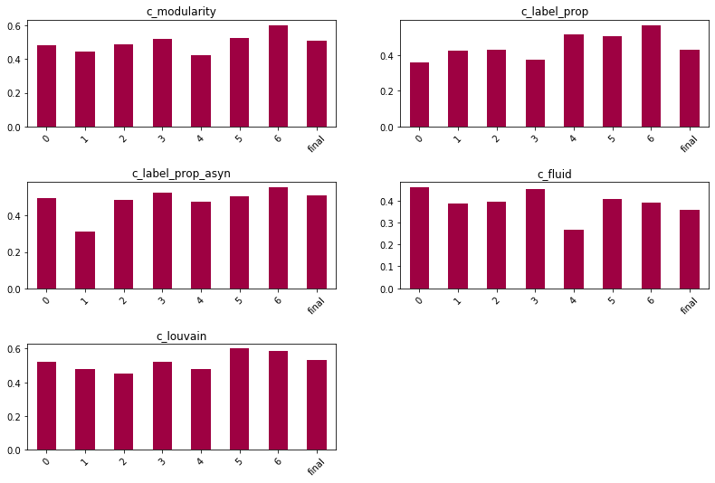

# User Location Classification in Hurricane Harvey
This is the first notebook in a series which are written primarily as a research logbook for the author. They are therefore not to be considered complete and do not represent the final analysis. For this -- see the final published papers and thesis, or contact the author directly.

The goal of this analysis is to evaluate methods by which users Tweeting about Hurricane Harvey may be classified as in the area or otherwise.

Data was collected with custom software which observed several Twitter streams and enhanced this information by querying the Twitter REST APIs for the network data (friends and followers) of each author. Stream volume which exceeded the capacity of the REST requests was discarded. 
* The keyword stream monitored the terms: [#harvey, #harveystorm, #hurricaneharvey, #corpuschristi]
* The GPS stream used the bounding box: [-99.9590682, 26.5486063, -93.9790001, 30.3893434]
* The collection period ran from 2017-08-26 01:32:18 until 2017-09-02 10:30:52 
* 55,605 Tweets by 33,585 unique authors were recorded

Data was coded using an interface built into the collection software by a primary coder. A secondary coder coded a sub-set of coded users for validation of the coding schema. User instances were coded by whether they 'appeared to be in the affected area'.

These notebooks access the data directly from the database using standard Django query syntax.

# Data Cleaning & Enrichment
In this chapter, we will investigate the data which was collected by the custom software. It is assessed for suitability for machine learning approaches, and enriched with synthesised features. The final result is a dataframe which is ready for statistical techniques which are presented in later chapters.

First we get all the coding instances made by the primary and secondary coders, and check the total codings of each class. There may be multiple coding dimensions (sets of coding schema), in which case the code requires adjustment to constrain to one.


```python
# Confirm correct database is set in Django settings.py
if 'Harvey' not in Event.objects.all()[0].name:
    raise Exception('Event name mismatch -- check connected database')
```


```python
import pandas as pd

# Get coding instances of user objects:
account_codings = (Coding.objects
                    .filter(coding_id=1)
                    .filter(user__isnull=False)
                    .filter(data_code__data_code_id__gt=0)
                  )
account_codings_secondary = (Coding.objects
                                 .filter(coding_id=2)
                                 .filter(user__isnull=False)
                            )

# Check available coding schema:

# Confirm correct database is set in Django settings.py
print('Dataset: ', Event.objects.all()[0].name)
dimensions = DataCodeDimension.objects.all()[1:]
for d in dimensions:
    print('Coding Dimension: ', d.name)
    print('Subject: ', d.coding_subject)
    print('Class Totals (primary / secondary): ')
    for code in d.datacode.all():
        print("\t {}: \t{} \t/ {}"
                .format(code.name, 
                    account_codings.filter(data_code__id=code.id).count(), 
                    account_codings_secondary.filter(data_code__id=code.id).count())
             )
print("{} Accounts coded by primary coder, {} by secondary coder.".format(account_codings.count(), account_codings_secondary.count()))
if len(dimensions) > 1: 
    print('\tNote: Totals represent sum of all codes from {} dimensions.'.format(len(dimensions)))
    print('WARNING: Code in cells below assume one dimension -- adjust to constrain.')
```

    Dataset:  Hurricane Harvey
    Coding Dimension:  Local
    Subject:  user
    Class Totals (primary / secondary): 
    	 Unsure: 	31 	/ 5
    	 Non-Witness: 	1083 	/ 94
    	 Witness: 	386 	/ 52
    1500 Accounts coded by primary coder, 151 by secondary coder.


We then create a dataframe of all users which have been coded by the primary coder to create the initial dataset. The subjects of the secondary coder are a subset of this set by design.


```python
# Get all Users coded by primary coder:
# (exclude data_code_id=0 as this is the temporary 'to be coded' class)
users = User.objects.filter(coding_for_user__coding_id=1, 
                            coding_for_user__data_code__data_code_id__gt=0)
users_df = pd.DataFrame(list(users.values()))

# Check for missing values by column:
users_df.count()[users_df.count() != account_codings.count()].sort_values(ascending=False)
```


    utc_offset                           920
    time_zone                            920
    undirected_eigenvector_centrality    890
    closeness_centrality                 890
    degree_centrality                    890
    eigenvector_centrality               890
    load_centrality                      890
    betweenness_centrality               890
    url                                  808
    old_screen_name                       98
    suspended                              0
    user_network_update_observed_at        0
    needs_phone_verification               0
    user_followers                         0
    katz_centrality                        0
    is_deleted_observed                    0
    is_deleted                             0
    user_followers_update                  0
    user_following                         0
    user_following_update                  0
    dtype: int64


* The centrality measures have a common value. As these values are only calculated for the largest connected component of the graph, this consistency makes sense.
* The fields time_zone, utc_offset, old_screen_name, and url are nullable.
* Twitter has deprecated the field 'needs_phone_verification', so no values were returned.
* Various 0 value fields had been added to the database schema but were not implemented at the time of collection. These can be safely dropped.


```python
# Dropping empty columns
empty_cols = users_df.columns[users_df.isnull().all()]
users_df.drop(empty_cols, axis=1, inplace=True)
```

We can also drop columns which have a single value, as they provide no differentiation:


```python
# Drop columns with only one unique value:
for col in users_df.columns:
    if len(users_df[col].value_counts()) <= 1:
        print('Dropping columns: ', col)
        users_df = users_df.drop([col], axis=1)
```

    Dropping columns:  protected
    Dropping columns:  ratio_media
    Dropping columns:  user_class


## Adding Location Data
There are a number of options which can represent the ground truth location of the user.
* Location listed on a user's profile
* User Timezone (deprecated)
* Manual Coding
* Location data derived from Tweet stream
    * GPS tagged Tweets
    * Mention of location in Tweet body
    
### Parsing user-set location in profile field
The location the user sets in their profile as a string is evaluated and a locality decision made. In this instance, a location is considered 'local' if its coordinates (supplied by the Google geolocation API or parsed directly from the location string) fall within the bounding box used for geographic Twitter data collection, or if it contains the string 'houston' or 'christi' (representing the town Corpus Christi). Both of these locations fall within the bounding box, and are used here as a time-saving operation.

Note that as this field can be set manually, it is unverifiable and therefore not a perfect representation of location, even where it exists. Users may neglect to update their location after moving, and some observations were made of users setting their location to that of a disaster event as a 'show of solidarity'.


```python
## This block supports manual coding of locations as local or non-local.
## It has been superceded by the next block which uses the Googlemaps API

#location_list = users_df.location.unique()
#with open('data/harvey_user_location/location_list_all_profile_locations.txt', 'w') as f:
#    for item in location_list:
#        f.write("%s\n" % item)

################
## This list then manually sorted and non-local locations removed.
## List of local locations then re-imported.
## Note this list excludes any locations containing 'Christi' or 'Houston'
## Note: if more users are coded, this list needs to be re-examined. Raise alert:
#if users_df.shape[0] != 931:
#    print('ALERT: New codings detected. Consider updating manual locality selection')
################

#with open('data/harvey_user_location/local_profile_locations_manual_check.txt', 'r') as f:
#    local_locations_list = f.read().splitlines()
    
## Create column for users with local location listed in profile
#users_df['local_profile_location_manual'] = \
#    (users_df.location.str.contains('houston|christi', case=False, regex=True) |
#    users_df.location.isin(local_locations_list))
```


```python
import re

def parse_coordinates(string):
    '''Parse a string for coordinates'''
    reg = '[nsewNSEW]?\s?-?\d+[\.°]\s?\d+°?\s?[nsewNSEW]?'
    result = re.findall(reg, string)
    if len(result) == 2: # Coordinates detected
        for i in range(len(result)):
            # Replace middle degree symbol with decimal:
            reg_middle_degree = '(\d+)°\s?(\d+)'
            result[i] = re.sub(reg_middle_degree, r'\1.\2', result[i])
            # Remove trailing degree symbol, N and E marks:
            reg_strip = '[°neNE\s]'
            result[i] = re.sub(reg_strip, '', result[i])
            # Replace south/west with negative sign:
            reg_replace_sw = '[swSW](\d+\.\d+)|(\d+\.\d+)[swSW]'
            result[i] = re.sub(reg_replace_sw, r'-\1\2', result[i])
            # Remove double negative (where string contained eg. '-99.10w')
            result[i] = re.sub('--', '-', result[i])
        return (float(result[0]), float(result[1]))
    else:
        return False
```


```python
import yaml
import googlemaps

def is_in_bounding_box(coords, boxes):
    '''
    Check whether coordinates fall within defined bounding box:
    Boxes are defined as their NW and SE points.
    '''
    for box in boxes:
        if coords[0] < box[0][0] and coords[0] > box[1][0]:
            if coords[1] > box[0][1] and coords[1] < box[1][1]:
                return True
    return False


def is_local(location, boxes, known_localities=[]):
    '''
    Check whether a location string falls within a set of 
    bounding boxes using Googlemaps API.
    '''
    if not location:
        return False
    # Check known localities first to save on API requests:
    for x in known_localities:
        if x in location:
            return True
    # Try and parse coordinates from string rather than API query:
    coords = parse_coordinates(location)
    # Get coords from API:
    if not coords:
        # Get API key from file:
        with open("auth.yml", 'r') as ymlfile:
            auth = yaml.load(ymlfile, Loader=yaml.BaseLoader)
        gmaps = googlemaps.Client(key=auth['apikeys']['googlemaps'])
        #########################################################
        ####### OVERRIDE API OBJECT TO PREVENT API CALLS: #######
        geocode_result = gmaps.geocode(location)
        #geocode_result = False
        #print('WARNING -- API DISABLED')
        #########################################################
        #########################################################
        if geocode_result:
            lat = geocode_result[0]['geometry']['location']['lat']
            lon = geocode_result[0]['geometry']['location']['lng']
            coords = (lat, lon)
    if coords:
        return(is_in_bounding_box(coords, boxes))
    return False
```


```python
# Bounding boxes used for Hurricane Harvey dataset:
boxes = [[(29.1197,-99.9590682),(26.5486063,-97.5021)],
        [(30.3893434,-97.5021),(26.5486063,-93.9790001)]]
# Don't need to look these up (save on API requests)
known_localities = ['houston', 'christi']

# Get list of locations in profiles:
users_df["location"] = users_df["location"].str.lower().str.strip()
location_list = users_df.location.dropna().unique()

# Create sublist of local/non-local locations (non-local only for manual verification)
print("Running is_local() for {} strings...".format(len(location_list)))
local_location_list = [loc for loc in location_list if is_local(loc, boxes, known_localities)]
non_local_location_list = [loc for loc in location_list if loc not in local_location_list]

# Create column for users with local location listed in profile
users_df['local_profile_location'] = users_df.location.str.lower().isin(local_location_list)

# Write lists to file to save calling API on kernel restart:
with open('data/harvey_user_location/location_list_from_api_local.txt', 'w') as f:
    for item in local_location_list:
        f.write("%s\n" % item)
with open('data/harvey_user_location/location_list_from_api_non_local.txt', 'w') as f:
    for item in non_local_location_list:
        f.write("%s\n" % item)
```


```python
# Use cached locations instead of querying API:
#users_df["location"] = users_df["location"].str.lower().str.strip()
#local_location_list_cached = []
#with open('data/harvey_user_location/location_list_from_api_local.txt', 'r') as f:
#    for line in f:
#        local_location_list_cached.append(line.rstrip('\n'))
#users_df['local_profile_location'] = users_df.location.str.lower().isin(local_location_list)
```

### Timezone Field
Timezone data provided by Twitter when capturing the user objects is less specific than other methods, but may be useful as a supplementary source.
As this data field has been deprecated by Twitter, it will not be available in new data sets.


```python
# View most prevalent time zones:
print(users_df['time_zone'].value_counts().head())

# Create column for profiles in relevant time zone (chosen manually):
relevant_timezone = 'Central Time (US & Canada)'
users_df['local_timezone'] = users_df.time_zone == relevant_timezone
users_df = users_df.drop(['time_zone', 'utc_offset'], axis=1)
```

    Central Time (US & Canada)     341
    Eastern Time (US & Canada)     197
    Pacific Time (US & Canada)     177
    Mountain Time (US & Canada)     37
    Quito                           25
    Name: time_zone, dtype: int64


### Manual Coding
Accounts were manually coded as 'local' or 'non-local'.

Coders were shown the user account details as well as the Twitter stream of the user. The coders were instructed to determine whether the user account was in an area affected by the hurricane at any point during the data collection period. Therefore, the term 'local' may be misleading to the reader, as the definition given to the coders will include anyone visiting the area as, for example, a responder or aid worker. This larger set of 'on the ground' users is a more useful target for classification.


```python
# Create column to represent manual coding:
users_df['coded_as'] = \
    users_df['screen_name'].apply(lambda x: account_codings.get(user__screen_name = x).data_code.name)

# Convert to one-hot encoding
users_df['coded_as_witness'] = users_df['coded_as'] == 'Witness'
users_df['coded_as_non_witness'] = users_df['coded_as'] == 'Non-Witness'

# Remove original column:
users_df = users_df.drop(['coded_as'], axis=1)
```

The 'Unsure' code is represented as `False` values in both the `coded_as_witness` and `coded_as_non_witness` columns. If the 'Unsure' rows are removed, we can also remove the `coded_as_non_witness` column (which is now represented as `False` in the `coded_as_witness` column).
<br /><br />

### GPS from Tweet stream
While the Tweets detected by the system may not contain GPS data, the author may have made other GPS-enabled Tweets during the collection period from which we can infer location. We create a column representing whether the user made any geolocated Tweets within the bounding box during the collection period.


```python
# Check whether any of a user's Tweets fall within the bounding box and update column:
# This will take several minutes to run

users_df['tweet_from_locality'] = False
users = users_df.screen_name.tolist()

for i in range(len(users)):
    if i%100 == 0:
        print('Progress: {} of {}: {}'.format(i, len(users)))
    try:
        geo_tweets = User.objects.get(screen_name=u).tweet.filter(coordinates_lat__isnull=False)
    except:
        print('Error with user: ', u)
        continue
    for tweet in geo_tweets:
        coords = (tweet.coordinates_lat, tweet.coordinates_lon)
        if is_in_bounding_box(coords, boxes):
            users_df.loc[users_df['screen_name'] == u, 'tweet_from_locality'] = True
            break
```

    1500
    User 10 of 1500: ChristiWilliams
    User 20 of 1500: OliviaFett
    User 30 of 1500: UHhousing
    User 40 of 1500: SmallTownDicks
    User 50 of 1500: WmBrockschmidt
    User 60 of 1500: marc_ahx
    User 70 of 1500: TamaraChanel
    User 80 of 1500: VotersDemand
    User 90 of 1500: MC_Halo687
    User 100 of 1500: TheBlazeKari
    User 110 of 1500: Ambersallin
    User 120 of 1500: Hamal
    User 130 of 1500: JMarkMcGinnis
    User 140 of 1500: deleon_sarita
    User 150 of 1500: meaneyreport
    User 160 of 1500: touchawe
    User 170 of 1500: Devil_dog_71
    User 180 of 1500: 2020Jobs
    User 190 of 1500: stevenmaislin
    User 200 of 1500: bquentin3
    Error with user:  TCAIS
    User 210 of 1500: Oscarluism_
    User 220 of 1500: hillarybeth
    Error with user:  SEFLCareers
    User 230 of 1500: homesteadraised
    User 240 of 1500: ArmyBtownAD
    User 250 of 1500: MagentaMelee
    User 260 of 1500: thepaigelewis
    User 270 of 1500: meVschristina
    User 280 of 1500: AvvBrosisky
    User 290 of 1500: JeremiahWheele1
    User 300 of 1500: KurtLKrieger
    User 310 of 1500: TrueDumbBlonde
    User 320 of 1500: MrAbdelLHS
    User 330 of 1500: LandlordLinks
    User 340 of 1500: gfbakery2014
    User 350 of 1500: JCP803
    User 360 of 1500: GinoMerlot
    User 370 of 1500: MeSSiaH_808
    User 380 of 1500: callinlexie
    User 390 of 1500: nikkinik528
    User 400 of 1500: JNLIII
    User 410 of 1500: IntentionallyKB
    User 420 of 1500: ezoptical
    User 430 of 1500: CabriLuigi
    User 440 of 1500: Bo_Wright
    User 450 of 1500: itzshelleybell
    User 460 of 1500: RWonMaui
    User 470 of 1500: Felixcalvince
    User 480 of 1500: PatMateluna
    User 490 of 1500: petermlotzemd1
    User 500 of 1500: IAmRobWu
    User 510 of 1500: TeviTroy
    User 520 of 1500: lovelyalica_
    User 530 of 1500: BizarroLuthor
    User 540 of 1500: austintindle
    User 550 of 1500: 2GrkGrls
    User 560 of 1500: weapon83
    User 570 of 1500: corgli
    User 580 of 1500: Heat975Action
    User 590 of 1500: SequoiaRE_EB
    User 600 of 1500: guss813
    User 610 of 1500: fatrat282
    User 620 of 1500: WendyFinneyWood
    User 630 of 1500: JohnnyKey_AR
    User 640 of 1500: SNSPP_PATS_FO_
    User 650 of 1500: NJS4EVER
    User 660 of 1500: ntebdwa
    User 670 of 1500: y81de
    User 680 of 1500: JackieSGolf
    User 690 of 1500: ThingsToShea
    User 700 of 1500: dallasreese
    User 710 of 1500: TurkWarfield
    User 720 of 1500: KaruniaAgung
    User 730 of 1500: catsterle
    User 740 of 1500: Jonathan4743
    User 750 of 1500: joal1969
    User 760 of 1500: youremysonshine
    User 770 of 1500: s_mellors
    User 780 of 1500: iamluvlady
    User 790 of 1500: MerrisBadcock
    User 800 of 1500: VictoriaBBurns
    User 810 of 1500: Margaret8OK
    User 820 of 1500: vicentearenastv
    User 830 of 1500: golivent1
    User 840 of 1500: ConmayS
    User 850 of 1500: EthanEmeryWX
    User 860 of 1500: LeahKWilliams
    User 870 of 1500: sameolg713
    User 880 of 1500: yanaincali
    User 890 of 1500: ChannelE2E
    User 900 of 1500: DJDLuxTx
    User 910 of 1500: SWELGL
    User 920 of 1500: abestesq
    User 930 of 1500: kyle_reidy
    User 940 of 1500: dontgruberme
    User 950 of 1500: BaneSaysTrump
    User 960 of 1500: dariameetsworld
    User 970 of 1500: SharpstownTX
    User 980 of 1500: RogueSquadronMC
    User 990 of 1500: shortmotivation
    User 1000 of 1500: DanielMoralesTV
    User 1010 of 1500: rcantu
    User 1020 of 1500: ZestyOrangePic
    User 1030 of 1500: ElenaRsv
    User 1040 of 1500: BeyondBlunt
    User 1050 of 1500: biominer86
    User 1060 of 1500: MikeImken
    User 1070 of 1500: Rosa_Sherrod
    User 1080 of 1500: wifeofJW
    User 1090 of 1500: AndreaROMANIN1
    User 1100 of 1500: TheBarkingPigTX
    User 1110 of 1500: lesleymesser
    User 1120 of 1500: Renate651
    User 1130 of 1500: BarryMyhawginya
    User 1140 of 1500: PepperBurns1
    User 1150 of 1500: RedPoliticalMan
    User 1160 of 1500: MrsBoothSays
    User 1170 of 1500: Foundry_HB
    User 1180 of 1500: VenatoreMedia
    User 1190 of 1500: KimiKentMusic
    User 1200 of 1500: SociologyofCC
    User 1210 of 1500: mlweldon5
    User 1220 of 1500: _ItEndsNow_
    User 1230 of 1500: LexeyJohnson
    User 1240 of 1500: not_DonnyTrump
    User 1250 of 1500: plsimmo
    User 1260 of 1500: lillamb1997
    User 1270 of 1500: JayleenHeft
    User 1280 of 1500: PrayerPictures
    User 1290 of 1500: HoustonISDGov
    User 1300 of 1500: BrownsteinHyatt
    User 1310 of 1500: olivesjoy
    User 1320 of 1500: bellinissima
    User 1330 of 1500: SUSANIRELAND4
    User 1340 of 1500: onlndtng_sucks
    User 1350 of 1500: DiscoverDior
    User 1360 of 1500: SMLaughna
    User 1370 of 1500: TweetsfromMsB
    User 1380 of 1500: ConveyerOfCool
    User 1390 of 1500: ocuellar10
    User 1400 of 1500: BusinessMoney5
    User 1410 of 1500: Ejwhite0
    User 1420 of 1500: Justin_Horne
    User 1430 of 1500: t3hasian
    User 1440 of 1500: palomaresjl
    User 1450 of 1500: SMUTexasMexico
    User 1460 of 1500: WeAreGoLocal
    User 1470 of 1500: ScoopALoop3
    User 1480 of 1500: JennyWCVB
    User 1490 of 1500: GalvHistory
    User 1500 of 1500: acman2k6


###  Temporary Export
The dataframe is exported to a csv file before further manipulation (and column dropping) to avoid repeating the expensive tasks above.


```python
import pandas as pd
path = 'data/harvey_user_location/df_users_temp.csv'

# Sanitise description field:
users_df["description"] = users_df["description"].str.replace("\r", " ")
users_df.to_csv(path)
```


```python
# Re-import and check rows match:
orig_shape = users_df.shape
users_df_temp = pd.read_csv(path, index_col=0)
if users_df_temp.shape == orig_shape:
    users_df = users_df_temp
else:
    print("Shape mis-match. Check string sanitisation")
```

## Data Enrichment
New features are synthesised from existing data.


Columns are added which represent the age of the user account (at the time of original collection) and at which point during the event the account was first detected by the stream.


```python
# Create columns to represent age of account at time of detection, and how soon
# after the beginning of the event that the account was first detected.

from datetime import datetime

# Calculate whole days between two dates:
def get_age_in_days(date_str, anchor_date):
    date_str = str(date_str) # In case date_str is already a datetime obj
    if date_str[-3:-2] == ":":
        date_str = date_str[:-3] + date_str[-2:]
    try:
        datetime_object = datetime.strptime(date_str, '%Y-%m-%d %H:%M:%S%z')
    except:
        datetime_object = datetime.strptime(date_str, '%Y-%m-%d %H:%M:%S.%f%z')
    return abs((anchor_date - datetime_object).days)

    
# Get dates of event:
e = Event.objects.all()[0]
end = max(e.time_end, e.kw_stream_end, e.gps_stream_end)
start = min(e.time_start, e.kw_stream_start, e.gps_stream_start)


# Create column for age of account at end of data collection period:
users_df['account_age'] = users_df['created_at'].apply(get_age_in_days, args=(end,))

# Create column for how early from beginning of event account was first detected:
users_df['day_of_detection'] = users_df['added_at'].apply(get_age_in_days, args=(start,))
```

An error in data collection allowed some `in_degree` and `out_degree` values to become negative. These are adjusted to 0. 

Note: It is possible that other entries have values one lower than what they should be.


```python
# Fix negative values in in_degree and out_degree: an error from data collection:
users_df.loc[users_df['in_degree'] < 0, 'in_degree'] = 0
users_df.loc[users_df['out_degree'] < 0, 'out_degree'] = 0
```

## Feature Encoding
Qualitative columns are converted into formats interpretable by a model.


```python
# Create column to represent length of profile description:
users_df['description_length'] = users_df.description.str.len()
#users_df = users_df.drop(['description_length'], axis=1)

# Profile language is English:
users_df['lang_is_en'] = users_df['lang'] == 'en'
users_df = users_df.drop(['lang'], axis=1)

# translator_type exists:
users_df['has_translator_type'] = users_df['translator_type'] != 'none'
users_df = users_df.drop(['translator_type'], axis=1)

# Url in profile:
users_df['has_url'] = users_df['url'].notnull()

# User has changed screen_name during collection period:
users_df['changed_screen_name'] = users_df['old_screen_name'].notnull()
```

We check for columns which should be represented categorically by counting the unique values in each column (under the assumption that categorical variables will have fewer than 20 unique values):


```python
# Check columns for categorical candidates:
for col in users_df.columns:
    if len(users_df[col].value_counts()) <= 20:
        if len(users_df[col].unique()) == 2 and 0 in users_df[col].unique() and 1 in users_df[col].unique():
            continue # Already encoded as True/False
        print(col)
        print(users_df[col].unique(),'\n')
```

    data_source
    [1 3] 
    
    day_of_detection
    [3 5 1 2 6 4 7 8] 
    


`day_of_detection` is an ordinal feature and is therefore untouched.

`data_source` is a categorical feature, so we re-encode it as a binary value. Here, the values of 1 and 3 are arbitrary (the 2 value was not implemented in the collection process).


```python
# Encoding categorical columns as one-hot:
# data_source==1 is not encoded as we only need n-1 columns to represent n categories.
users_df['is_data_source_3'] = users_df['data_source'] == 3.
users_df = users_df.drop(['data_source'], axis=1)
```

True/False columns are converted to 1/0 values for model compatibility


```python
# Convert True/False columns to 1/0
print('Converting columns from boolean to binary:\n')
for col in users_df.columns:
    if (len(users_df[col].value_counts()) == 2 and 
            True in users_df[col].values and 
            False in users_df[col].values):
        print(col)
        users_df[col] = users_df[col].astype(int)
```

    Converting columns from boolean to binary:
    
    default_profile
    default_profile_image
    geo_enabled
    has_extended_profile
    is_translation_enabled
    verified
    local_profile_location
    local_timezone
    coded_as_witness
    coded_as_non_witness
    tweet_from_locality
    lang_is_en
    has_translator_type
    has_url
    changed_screen_name
    is_data_source_3


## Export to File


```python
import pandas as pd

path = 'data/harvey_user_location/df_users.csv'

users_df.to_csv(path)

# Re-import and check rows match:
orig_shape = users_df.shape
users_df_temp = pd.read_csv(path, index_col=0)
if users_df_temp.shape == orig_shape:
    users_df = users_df_temp
    print('Dataframe exported to CSV.')
    print(users_df.shape)
else:
    print("Shape mis-match. Check string sanitisation")

```

    Dataframe exported to CSV.
    (1500, 45)


# Testing Community Detection Data


A visual inspection of the follower/friend network of detected users (pictured above) shows a clear community structure. This suggests that there are certain user features that influence the propensity for a user to follow another user with similar features. These may be features which we have observed and recorded, or other features which we cannot predict. This can be tested by using community detection algorithms to partition the nodes of the graph into these communities, and then comparing these partitions to features with which they may be associated. Primarily, we are interested in whether these communities are related to whether a user is a 'witness' or not, as per our manual coding. If this is the case, the community metrics can be a useful feature in our models.

The image below shows a representation of the same network structure, where only the 1500 coded nodes are displayed in colours which represent their codes. The general grouping of orange nodes towards one section of the graph which corresponds with a community cluster shown in the original graph structure suggests that this community contains a greater proportion of witness nodes and therefore is a dependent feature. A preliminary hypothesis is that local users are more likely to follow one another (thus forming this community) and are also more likely to be witnesses. If true, this community could accurately predict which users are local and therefore, more likely to be witnesses.


The following image shows the output of a community detection algorithm which has partitioned the graph. In this example, the pink community appears to represent the witness group shown in the previous image.


## Evaluating Community Algorithms
In the following section, the original dataframe is enhanced with modularity metrics. These are features which are calculated based upon the graph structure of the user friend/follower network. There are a number of community detection algorithms, so a set of these have been calculated to be tested and compared for association to the target (witness) class.

Community metrics were calculated using the `networkx` implementations of `greedy_modularity_communities`, `label_propagation_communities`, `asyn_lpa_communities`, `asyn_fluidc` and `community_louvain` from the `community` package. These were performed in a separate script for the sake of testing and will ideally be calculated by the data collection software at the end of the collection process in future iterations.

The graph includes all detected users (i.e. not their followers/friends unless they were also detected as authors) for a total of 31,496 nodes and 99,602 edges. Community detection was performed on subgraph representing the largest connected component of 17,958 nodes and 75,203 edges. 

As most algorithms require an undirected graph, the direction of relationships was ignored.

Communities are labelled as numbers according to their ranking in size (where 0 is the largest), thus the labels have some level of ordinality.


```python
import networkx as nx

def get_graph_object():
    EVENT_NAME = Event.objects.all()[0].name.replace(' ', '')
    FILENAME = 'network_data_{}_v1.gexf'.format(EVENT_NAME)
    DIR = './data/harvey_user_location/'
    try:
        # Load cached file if available
        G = nx.read_gexf(DIR + FILENAME)
        print('Importing existing graph object...')
    except:
        print('Creating new graph object...')
        classed_users = User.objects.filter(user_class__gte=1)
        edges = Relo.objects.filter(target_user__in=classed_users, source_user__in=classed_users, end_observed_at=None)
        G=nx.DiGraph()
        for node in classed_users:
            try:
                user_code = node.coding_for_user.filter(coding_id=1).exclude(data_code__name='To Be Coded')[0].data_code.name
            except:
                user_code = ''
            G.add_node(node.screen_name, user_class=node.user_class, user_code=user_code)
        edge_list = [(edge.source_user.screen_name, edge.target_user.screen_name) for edge in edges]
        G.add_edges_from(edge_list)
        # Write to file and re-import to bypass issue with community algorithms
        nx.write_gexf(G, DIR + FILENAME, prettyprint=True)
        G = nx.read_gexf(DIR + FILENAME)
    return G
```


```python
# Modularity:   https://scholar.google.com/scholar?q=Finding+community+structure+in+very+large+networks
# Label Prop:   https://neo4j.com/docs/graph-algorithms/current/algorithms/label-propagation/#algorithms-label-propagation-sample
# Louvain:      https://github.com/taynaud/python-louvain/blob/master/docs/index.rst

import networkx as nx
from networkx.algorithms.community import greedy_modularity_communities, label_propagation_communities, asyn_lpa_communities, asyn_fluidc, girvan_newman
import community as community_louvain
from collections import Counter

def calc_community_metrics(filename=False, G=None):
    DIR = './data/harvey_user_location/'
    
    FLIUD_COMMUNITIES_NUMBER = 8
    RETURN_GIANT_COMPONENT = True # Only save giant component to graph objects
    
    if filename:
        try:
            # Load cached file if available
            G = nx.read_gexf(DIR + filename)
            print('Importing existing community graph object...')
            return G
        except:
            pass
    
    print('Calculating community metrics...')
    if not G:
        print('Getting complete graph...')
        G = get_graph_object()
    print('Original graph has {} nodes and {} edges.'.format(len(G), G.number_of_edges()))

    # Create undirected graph (required for community detection):
    H = nx.Graph(G)

    # Get largest component
    Hcc = max(nx.connected_components(H), key=len)
    H0 = H.subgraph(Hcc)
    print('Largest component has {} nodes and {} edges.'.format(len(H0), H0.number_of_edges()))

    # Discard other components:
    if RETURN_GIANT_COMPONENT:
        G = G.subgraph(Hcc)

    # Get communities
    print('Calculating c_modularity...')
    c_modularity = list(greedy_modularity_communities(H0))
    print('Calculating c_label_prop...')
    c_label_prop = list(label_propagation_communities(H0))
    c_label_prop = sorted(c_label_prop, key=len, reverse=True)
    print('Calculating c_label_prop_asyn...')
    c_label_prop_asyn = list(asyn_lpa_communities(H0))
    c_label_prop_asyn = sorted(c_label_prop_asyn, key=len, reverse=True)
    print('Calculating c_fluid...')
    c_fluid = list(asyn_fluidc(H0, FLIUD_COMMUNITIES_NUMBER))
    c_fluid = sorted(c_fluid, key=len, reverse=True)
    # TOO SLOW:
    # print('Calculating c_girvan_newman...')
    # c_girvan_newman = list(girvan_newman(H0))

    community_output_dict = {'c_modularity': c_modularity,
                                'c_label_prop': c_label_prop,
                                'c_label_prop_asyn': c_label_prop_asyn,
                                'c_fluid': c_fluid,
                                # 'c_girvan_newman': c_girvan_newman
                                }

    print('Adding data as node attributes...')
    # Add communities to node attributes:
    for key in community_output_dict:
        community_dict = {}
        for i, c in enumerate(community_output_dict[key]):
            for name in c:
                community_dict[name] = i
        nx.set_node_attributes(G, community_dict, key)

    # Repeat for louvain algorithm.
    print('Calculating c_louvain...')
    partition = community_louvain.best_partition(H0)
    # Reset community indices by size
    counter = Counter(partition.values())
    ranking = sorted(counter, key=counter.get, reverse=True)
    partition_sorted = {k: ranking.index(v) for k, v in partition.items()}
    # Add to node attribute
    print('Adding data to node attribute...')
    nx.set_node_attributes(G, partition_sorted, 'c_louvain')

    if filename:
        print('Writing to file...')
        nx.write_gexf(G, DIR + filename, prettyprint=True)
        
    return G
```


```python
import pandas as pd

e = Event.objects.all()[0]
filename = 'network_data_{}_comm.gexf'.format(e.name.replace(' ', ''))

G = calc_community_metrics(filename)

nodes = G.nodes(data=True)
df_comm = pd.DataFrame.from_dict(dict(nodes), orient='index')
df_comm = df_comm.drop(['user_class', 'user_code', 'label'], axis=1)
#df_comm = df_comm.reset_index(drop=True)
df_comm.head()
```

    Calculating community metrics...
    Getting complete graph...
    Importing existing graph object...
    Original graph has 31931 nodes and 101096 edges.
    Largest component has 18409 nodes and 76341 edges.
    Calculating c_modularity...


```python
# Open original Dataframe
import pandas as pd

path = 'data/harvey_user_location/df_users.csv'

users_df = pd.read_csv(path, index_col=0)
users_df.shape
```


```python
# Create list of community algorithm column names
comm_cols = list(df_comm.columns)

# Merge dataframes
users_df = pd.merge(left=users_df, right=df_comm, how='left', left_on='screen_name', right_index=True)

users_df.head()
```

As chi-square tests are typically recommended to require contingency tables with values of at least 5, the small communities are discarded (also, some algorithms create many communities of 1-2 members, which will not be useful in generalisation of the model).

TODO: This only eliminates cells where the observed value is less than 5, this rule should also be applied to expected value cells.


```python
# Ignore small communities where observed cases are too low (required for chi-square tests)
MIN_COMMUNITY_SIZE = 5

for col in comm_cols:
    s = users_df[col].value_counts()
    #s = users_df.loc[users_df['coded_as_witness']==1, col].value_counts()
    users_df.loc[~users_df[col].isin(s.index[s >= MIN_COMMUNITY_SIZE]), col] = np.NaN
```

As a preliminary visual investigation into the relationship between community and code, we can check the proportion of nodes within a community that are coded as positive cases (witnesses). In an independent case, we would expect these ratios to be similar, and reflect the overall ratio of cases, which is:
$$\frac{386}{1500} = 0.257$$
This is shown as a dotted line on the plots below.


```python
%matplotlib inline
import matplotlib.pyplot as plt
plt.rcParams['figure.figsize'] = [12, 8]

# NOTE: required input is a list of series, not dataframes
def plot_dfs_as_bar(df_list, axhline=None):
    if len(df_list) == 1:
        df_list[0].plot(kind='bar', title=df_list[0].name, colormap='Spectral', rot=45)
        return
    ncol = 2
    nrow = int((len(df_list)+1)/2)
    fig, axs = plt.subplots(nrow,ncol)
    fig.tight_layout(pad=4.0)
    if len(df_list) % 2 != 0:
        fig.delaxes(axs[nrow-1,1])
    count=0
    for r in range(nrow):
        for c in range(ncol):
            if count < len(df_list): # Handle odd length
                if len(df_list) > 2:
                    df_list[count].plot(kind='bar', ax=axs[r,c], title=df_list[count].name, colormap='Spectral', rot=45)
                else:
                    df_list[count].plot(kind='bar', ax=axs[c], title=df_list[count].name, colormap='Spectral', rot=45)
                #axs[r,c].text(.5, .9, df_list[count].name, horizontalalignment='center', transform=axs[r,c].transAxes, bbox=dict(facecolor='red', alpha=0.5))
                if axhline:
                    axs[r,c].axhline(y=axhline, color='b', linestyle='dotted', lw=2)
                count += 1
```


```python
# Create dataframe for ratio of positive cases per community class, for each community algorithm
df_list = [users_df.loc[users_df['coded_as_witness']==1, col].dropna().value_counts() / 
               users_df[col].dropna().value_counts() 
               for col in comm_cols]

# Calculate expected proportion of positive cases given independence:
exp_pos_proportion = users_df['coded_as_witness'].value_counts()[1] / users_df.shape[0]

plot_dfs_as_bar(df_list, exp_pos_proportion)
```

From inspecting the graphs above, there appears to be a disproportionate amount of positive cases in certain communities, suggesting some association between community (as detected by a given algorithm) and the classification. Therefore, it is likely that including these metrics will increase the information available to the predictive models.

The charts shown above suggest that the highest proportion of positive classes appear in the largest, or second-largest communities (as the labels have been ranked in order of size). This is significant -- a model cannot be trained on community label as a feature, as the labels are qualitative and will be different each time an algorithm runs on a network. Therefore these features cannot generalise to new datasets. The feature that is supplied must therefore be something which is generalisable; in this case, the ranking of the community by size my be appropriate (for example, a feature which represents whether a user is in the largest detected community). Alternatively, communities may exhibit different characteristics such as connectedness. This will be explored later. The higher proportions seen in some of the later communities are less relevant as these are of a much smaller size. Thus the high proportions are 'easier' to achieve, and as smaller communities are more likely to represent unique cases, they are less likely to generalise.

The next steps in the analyis of the validity of this approach is the calculate whether the disparities observed above are statistically significant. That is, whether these associations could have been observed by chance.

Formally, for each community detection algorithm, we are testing the hypotheses:
$$H_0: \text{There is no association between the community label and witness label}$$
$$H_A: \text{There is an association between the community label and witness label}$$

A chi-squre analysis is performed on the output of each detection algorithm with the target class. Note that communities with a size below 5 are removed as per the recommendation for chi-square analysis.


```python
import scipy.stats as scs

def chi_square_of_df_cols(df, col1, col2):
    confusion_matrix = pd.crosstab(df[col2], df[col1])
    # Remove rows where observed cases are too low -- TODO: should also check expected values are > 4
    confusion_matrix = confusion_matrix.loc[(confusion_matrix[0] > 4) & (confusion_matrix[1] > 4)]
    return scs.chi2_contingency(confusion_matrix)

y_col = 'coded_as_witness'
data = [[col] + list(chi_square_of_df_cols(users_df, y_col, col)[:2]) for col in comm_cols]

chi2a_df = pd.DataFrame(data=data, columns=['feature', 'chi-square-a', 'p-val'])
#chi2a_df.plot(kind='bar', y='chi2', x='feature', rot=45)
chi2a_df
```

For all features, the analysis produced a significant $\chi^2$ value, well beyond our $\alpha=0.05$. Therefore we can reject the null hypothesis and accept that the alternative: there is an association between community and witness status.

In the following cells, a number of other measures of association are tested, including the `sklearn` implementation of chi-square.

We are now interested in selecting the community algorithm which is most useful in class prediction.


```python
from sklearn.feature_selection import chi2

#TODO: only drop NA rows per column rather than entire row.
temp_df = users_df[comm_cols + ['coded_as_witness']].dropna()

X = temp_df[comm_cols]
y = temp_df['coded_as_witness']

chi2b_df = pd.DataFrame(data={'feature': comm_cols, 'chi-square-b': chi2(X,y)[0], 'p-val': chi2(X,y)[1]})
#chi2b_df.plot(kind='bar', y='chi2', x='feature', rot=45)
chi2b_df
```


<div>
<table border="1" class="dataframe">
  <thead>
    <tr style="text-align: right;">
      <th></th>
      <th>feature</th>
      <th>chi-square-b</th>
      <th>p-val</th>
    </tr>
  </thead>
  <tbody>
    <tr>
      <th>0</th>
      <td>c_modularity</td>
      <td>120.389792</td>
      <td>5.197549e-28</td>
    </tr>
    <tr>
      <th>1</th>
      <td>c_label_prop</td>
      <td>203.008977</td>
      <td>4.605000e-46</td>
    </tr>
    <tr>
      <th>2</th>
      <td>c_label_prop_asyn</td>
      <td>206.310091</td>
      <td>8.768650e-47</td>
    </tr>
    <tr>
      <th>3</th>
      <td>c_fluid</td>
      <td>15.877921</td>
      <td>6.756234e-05</td>
    </tr>
    <tr>
      <th>4</th>
      <td>c_louvain</td>
      <td>268.643853</td>
      <td>2.241188e-60</td>
    </tr>
  </tbody>
</table>
</div>


```python

```

`sklearn.feature_selection.chi2` uses a different implementation of the chi-square formula, therefore these result differ from the results returned by `scipy.stats.scs.chi2_contingency`. Regardless, the each of the p-values is sufficiently small to reject the null hypothesis and accept that there is an association.

 A p-value close to zero means that our variables are very unlikely to be completely unassociated in some population. However, this does not mean the variables are strongly associated; a weak association in a large sample size may also result in p = 0.000.
 
Given that we would like to choose the algorithm which results in the communities with the strongest associations to the target label, we need another statistical measure. Cramérs $\phi$ (or V) coefficient is based upon the $\chi^2$ value and measures the strength the association between two categorical variables. Here, a score of $0$ represents no association, and $1$ represents a perfect association.

$${\phi}_c = \sqrt{\frac{\chi^2}{N(k-1)}}$$


```python
def cramers_v(x, y):
    confusion_matrix = pd.crosstab(x,y)
    chi2 = scs.chi2_contingency(confusion_matrix)[0]
    n = confusion_matrix.sum().sum()
    phi2 = chi2/n
    r,k = confusion_matrix.shape
    phi2corr = max(0, phi2-((k-1)*(r-1))/(n-1))
    rcorr = r-((r-1)**2)/(n-1)
    kcorr = k-((k-1)**2)/(n-1)
    return np.sqrt(phi2corr/min((kcorr-1),(rcorr-1)))

# Drop na values from y col
temp_df = users_df[comm_cols + ['coded_as_witness']].dropna()
y = temp_df['coded_as_witness']

data = [(col, cramers_v(temp_df[col],y)) for col in comm_cols]
cramers_df = pd.DataFrame(data=data, columns=['feature', 'cramers_v'])
#cramers_df.plot(kind='bar', x='feature', rot=45)
cramers_df
```

While Cramer's Phi measures the strength of the association, Theil's U is a conditional measure. That is, it is able to measure how well we can predict one variable, given the other. Therefore, it is a more suitable statistic when evaluating features to use in prediction models.


```python
import math
from collections import Counter

def conditional_entropy(x, y, log_base: float = math.e):
    y_counter = Counter(y)
    xy_counter = Counter(list(zip(x, y)))
    total_occurrences = sum(y_counter.values())
    entropy = 0.0
    for xy in xy_counter.keys():
        p_xy = xy_counter[xy] / total_occurrences
        p_y = y_counter[xy[1]] / total_occurrences
        entropy += p_xy * math.log(p_y / p_xy, log_base)
    return entropy

def theils_u(x, y):
    s_xy = conditional_entropy(x,y)
    x_counter = Counter(x)
    total_occurrences = sum(x_counter.values())
    p_x = list(map(lambda n: n/total_occurrences, x_counter.values()))
    s_x = scs.entropy(p_x)
    if s_x == 0:
        return 1
    else:
        return (s_x - s_xy) / s_x
    
# Drop na values from y col
temp_df = users_df[comm_cols + ['coded_as_witness']].dropna()
y = temp_df['coded_as_witness']

#data = [(col, theils_u(temp_df[col],y)) for col in community_cols]
data = [(col, theils_u(y, temp_df[col])) for col in comm_cols]
theils_df = pd.DataFrame(data=data, columns=['feature', 'theils_u'])
#theils_df.plot(kind='bar', x='feature', rot=45)
theils_df

```

Decision Trees (and their ensemble random forest counterparts) can rank features on their importance, where their importance represents how much reduction of the (gini) uncertainty measure each feature contributes to the model. Note that due to how decision trees learn, these importance values can vary each time a model is trained, though this variance should be minimised in ensemble methods.


```python
from sklearn.tree import DecisionTreeRegressor, DecisionTreeClassifier
from sklearn.ensemble import RandomForestClassifier
import warnings

# Ignore FutureWarning from RF classifier
warnings.simplefilter(action='ignore', category=FutureWarning)

X = users_df[comm_cols]
y = users_df['coded_as_witness']
for col in comm_cols:
    y = y.loc[~X[col].isna()]
    X = X.loc[~X[col].isna()]

##tree = DecisionTreeRegressor().fit(X, y)
#tree = DecisionTreeClassifier().fit(X, y)
tree = RandomForestClassifier().fit(X, y)

rf_df = pd.DataFrame(zip(comm_cols, tree.feature_importances_), 
               columns =['feature', 'importance']) 

#rf_df.plot(kind='bar', x='feature', rot=45)
rf_df
```


<div>
<table border="1" class="dataframe">
  <thead>
    <tr style="text-align: right;">
      <th></th>
      <th>feature</th>
      <th>importance</th>
    </tr>
  </thead>
  <tbody>
    <tr>
      <th>0</th>
      <td>c_modularity</td>
      <td>0.234433</td>
    </tr>
    <tr>
      <th>1</th>
      <td>c_label_prop</td>
      <td>0.087224</td>
    </tr>
    <tr>
      <th>2</th>
      <td>c_label_prop_asyn</td>
      <td>0.096274</td>
    </tr>
    <tr>
      <th>3</th>
      <td>c_fluid</td>
      <td>0.201301</td>
    </tr>
    <tr>
      <th>4</th>
      <td>c_louvain</td>
      <td>0.380768</td>
    </tr>
  </tbody>
</table>
</div>


We can now compare the algorithms across each association measure. Theil's U and perhaps the random forest feature importance measures are more significant here. The Louvain and modularity measures appear to be the most promising. The asynchronous implementation of label propogation appears to outperform its synchronous counterpart, though it's overall relevance requires further investigation.


```python
df_list = [chi2a_df, chi2b_df, cramers_df, theils_df, rf_df]
indices = chi2a_df['feature'].values
df_list = [x.set_index('feature').iloc[:,0] for x in df_list]

plot_dfs_as_bar(df_list)
```


## Evaluation on Temporal Sub-Graphs

While the analysis above demonstrates the predictive power of these algorithms at the end point of an event, once the graph data is most rich, the purpose of this research is to classify user objects as they are detected. Therefore, we need to test the efficacy of these algorithms on partial graphs, as they appeared throughout the data collection process.

Data was collected over the course of several days for this event, therefore we can create subgraphs at intervals an re-calculate the metrics discussed above. This function creates a subgraph as it existed at every 24-hour interval from the event start time. Therefore, for the Hurricane Harvey event, which was recorded over 7 days and 10 hours, 7 sub-graphs are generated. With the final graph, there are a total of 8 graphs. Each graph contains all the data of the graph preceding it plus the newly observed users and their common relationships.

The same transormations as above are then applied and the association measures calculated. It is expected that the measures increase over time, as the network structure is revealed. We are therefore interested in observing the rate at which is happens.


```python
import networkx as nx
from datetime import timedelta

def get_graph_objects_time_sliced():
    """
    Creates subgraphs of the main event's graph every 24 hours 
    from start date.
    
    Sub-graphs are returned in a dictionary keyed by their
    slice index, where t_n = k*24h. The dictionary will not
    include the final, complete graph.
    """
    EVENT_NAME = Event.objects.all()[0].name.replace(' ', '')
    DIR = './data/harvey_user_location/'
    
    # Get event and calculate duration:
    e = Event.objects.all()[0]
    end = max(e.time_end, e.kw_stream_end, e.gps_stream_end)
    start = min(e.time_start, e.kw_stream_start, e.gps_stream_start)
    duration_days = (end - start).days
    print('Days in event: {}: {} '.format(e.name, duration_days))
    # Create timestamps every 24 hours:
    interim_time_slices = [start + timedelta(days=t+1) for t in range(duration_days)]
    # Reverse list to support progressively paring down subset queries:
    interim_time_slices.reverse()
    
    graph_dict = {}
    print('Getting user and edge list for full graph...')
    classed_users = User.objects.filter(user_class__gte=1)
    edges = Relo.objects.filter(target_user__in=classed_users, source_user__in=classed_users, end_observed_at=None)
    
    # Create subgraphs for each time stamp in reverse chronological order:
    for i in range(len(interim_time_slices)):
        filename = 'network_data_{}_tslice-{}.gexf'.format(EVENT_NAME, len(interim_time_slices)-i)
        try:
            # Load cached file if available
            G = nx.read_gexf(DIR + filename)
            print('Importing existing graph object for time slice {} ...'.format(i))
        except:
            print('Creating new graph object for time slice {}...'.format(i))
            # Subset classed users for those added prior to slice point:
            classed_users = classed_users.filter(added_at__lt=interim_time_slices[i])
            G=nx.DiGraph()
            for node in classed_users:
                try:
                    user_code = (node.coding_for_user.filter(coding_id=1)
                                .exclude(data_code__name='To Be Coded')[0]
                                .data_code.name)
                except:
                    user_code = ''
                G.add_node(node.screen_name, user_class=node.user_class, user_code=user_code)
            # Subset edges to those associated with subset of users
            edges = edges.filter(target_user__in=classed_users, 
                                    source_user__in=classed_users)
            edge_list = [(edge.source_user.screen_name, edge.target_user.screen_name) for edge in edges]
            G.add_edges_from(edge_list)
            # Write to file and re-import to bypass issue with community algorithms
            nx.write_gexf(G, DIR + filename, prettyprint=True)
            G = nx.read_gexf(DIR + filename)
            
        graph_dict[len(interim_time_slices)-i] = G
        
    return graph_dict
```


```python
g_dict = get_graph_objects_time_sliced()
```

    Days in event: Hurricane Harvey: 7 
    Getting user and edge list...
    Importing existing graph object for time slice 0 ...
    Importing existing graph object for time slice 1 ...
    Importing existing graph object for time slice 2 ...
    Importing existing graph object for time slice 3 ...
    Importing existing graph object for time slice 4 ...
    Importing existing graph object for time slice 5 ...
    Importing existing graph object for time slice 6 ...


Calculate the community metrics for each subgraph and create time slice dataframes for each metric:


```python
import scipy.stats as scs
from sklearn.tree import DecisionTreeRegressor, DecisionTreeClassifier
from sklearn.ensemble import RandomForestClassifier
from sklearn.feature_selection import chi2
# #g_dict[1].nodes
# dff = pd.DataFrame()

# dgg = pd.DataFrame(data=[[1,'a',3],[2,'b',3],[3,'c',3]], columns=['feature', 'chi-square-a', 'p-val'])
# s = dgg.set_index('feature')['chi-square-a']
# dff.append(s, ignore_index=True)


# #g_dict[1].nodes(data=True)
# #     df_comm = pd.DataFrame.from_dict(dict(nodes), orient='index')
# #     df_comm = df_comm.drop(['user_class', 'user_code', 'label'], axis=1)
    
# #     # Merge dataframes
# #     path = 'data/harvey_user_location/df_users.csv'
# #     users_df_temp = pd.read_csv(path, index_col=0)
# #     comm_cols = list(df_comm.columns)
```


```python
import pandas as pd
# Ignore FutureWarning from RF classifier
import warnings
warnings.simplefilter(action='ignore', category=FutureWarning)


DIR = './data/harvey_user_location/'
    
g_dict_comm = {}


#df_comm.columns
tslice_chi2a_df = pd.DataFrame()
tslice_chi2b_df = pd.DataFrame()
tslice_cramers_df = pd.DataFrame()
tslice_theils_df = pd.DataFrame()
tslice_rf_df = pd.DataFrame()


# Calculate the community metrics for each subgraph:
for key in g_dict:
    print('Processing subgraph: ', key)
    e = Event.objects.all()[0]
    filename = 'network_data_{}_comm_tslice-{}.gexf'.format(e.name.replace(' ', ''), key)
    g2 = g_dict[key]
    
    # Write and reimport to avoid issue with community calculation:
    nx.write_gexf(g2, DIR + 'temp.gexf', prettyprint=True)
    g2 = nx.read_gexf(DIR + 'temp.gexf')
    
    # Calc community metrics for graph
    g2 = calc_community_metrics(filename, g2)
    g_dict_comm[key] = g2
    
    # Create community dataframe
    nodes = g2.nodes(data=True)
    df_comm = pd.DataFrame.from_dict(dict(nodes), orient='index')
    df_comm = df_comm.drop(['user_class', 'user_code', 'label'], axis=1)
    
    # Merge dataframes
    path = 'data/harvey_user_location/df_users.csv'
    users_df_temp = pd.read_csv(path, index_col=0)
    comm_cols = list(df_comm.columns)
    users_df_temp = pd.merge(left=users_df_temp, right=df_comm, how='left', left_on='screen_name', right_index=True)

    # Ignore small communities where observed cases are too low (required for chi-square tests)
    MIN_COMMUNITY_SIZE = 5
    for col in comm_cols:
        s = users_df_temp[col].value_counts()
        users_df_temp.loc[~users_df_temp[col].isin(s.index[s >= MIN_COMMUNITY_SIZE]), col] = np.NaN

    # Calculate chi-square
    y_col = 'coded_as_witness'
    data = [[col] + list(chi_square_of_df_cols(users_df_temp, y_col, col)[:2]) for col in comm_cols]
    chi2a_df_subgraph = pd.DataFrame(data=data, columns=['feature', 'chi-square-a', 'p-val'])
    s = chi2a_df_subgraph.set_index('feature')['chi-square-a']
    tslice_chi2a_df = tslice_chi2a_df.append(s, ignore_index=True)
    
    # Calculate chi-square b
    temp_df = users_df_temp[comm_cols + ['coded_as_witness']].dropna()
    X = temp_df[comm_cols]
    y = temp_df['coded_as_witness']
    chi2b_df_subgraph = pd.DataFrame(data={'feature': comm_cols, 'chi-square-b': chi2(X,y)[0], 'p-val': chi2(X,y)[1]})
    s = chi2b_df_subgraph.set_index('feature')['chi-square-b']
    tslice_chi2b_df = tslice_chi2b_df.append(s, ignore_index=True)
    
    # Cramer's V
    temp_df = users_df_temp[comm_cols + ['coded_as_witness']].dropna()
    y = temp_df['coded_as_witness']
    data = [(col, cramers_v(temp_df[col], y)) for col in comm_cols]
    cramers_df_subgraph = pd.DataFrame(data=data, columns=['feature', 'cramers_v'])
    s = cramers_df_subgraph.set_index('feature')['cramers_v']
    tslice_cramers_df = tslice_cramers_df.append(s, ignore_index=True)
    
    # Theil's U
    temp_df = users_df_temp[comm_cols + ['coded_as_witness']].dropna()
    y = temp_df['coded_as_witness']
    data = [(col, theils_u(y, temp_df[col])) for col in comm_cols]
    theils_df_subgraph = pd.DataFrame(data=data, columns=['feature', 'theils_u'])
    s = theils_df_subgraph.set_index('feature')['theils_u']
    tslice_theils_df = tslice_theils_df.append(s, ignore_index=True)
    
    # Random Forest
    X = users_df_temp[comm_cols]
    y = users_df_temp['coded_as_witness']
    for col in comm_cols:
        y = y.loc[~X[col].isna()]
        X = X.loc[~X[col].isna()]
    tree = RandomForestClassifier().fit(X, y)
    rf_df_subgraph = pd.DataFrame(zip(comm_cols, tree.feature_importances_), 
                                   columns =['feature', 'importance']) 
    s = rf_df_subgraph.set_index('feature')['importance']
    tslice_rf_df = tslice_rf_df.append(s, ignore_index=True)
    
    
```

    Processing subgraph:  7
    Importing existing community graph object...
    Processing subgraph:  6
    Importing existing community graph object...
    Processing subgraph:  5
    Importing existing community graph object...
    Processing subgraph:  4
    Importing existing community graph object...
    Processing subgraph:  3
    Importing existing community graph object...
    Processing subgraph:  2
    Importing existing community graph object...
    Processing subgraph:  1
    Importing existing community graph object...


```python
node_counts = pd.Series([len(g) for g in g_dict_comm.values()] + [0]).iloc[::-1].reset_index(drop=True)
node_counts.name = 'nodes'
edge_counts = pd.Series([g.number_of_edges() for g in g_dict_comm.values()] + [0]).iloc[::-1].reset_index(drop=True)
edge_counts.name = 'edges'
dff = pd.concat([node_counts, edge_counts], axis=1)
#dff.loc['final'] = [18409, 76341] # TODO: Hardcoded for convenience. Find original graph object instead (largest component).
dff.plot(title='Graph Growth per 24h')
```


    <matplotlib.axes._subplots.AxesSubplot at 0x7fa5777a7278>


```python
# Set indices to timestamp ids and sort chronologically:
dfs = [tslice_chi2a_df, tslice_chi2b_df, tslice_cramers_df, tslice_theils_df, tslice_rf_df]
indices = list(g_dict.keys())

for frame in dfs:
    frame.index = indices
    frame = frame.sort_index()
```


```python
tslice_chi2a_df
```


<div>
<table border="1" class="dataframe">
  <thead>
    <tr style="text-align: right;">
      <th></th>
      <th>c_fluid</th>
      <th>c_label_prop</th>
      <th>c_label_prop_asyn</th>
      <th>c_louvain</th>
      <th>c_modularity</th>
    </tr>
  </thead>
  <tbody>
    <tr>
      <th>7</th>
      <td>159.854151</td>
      <td>33.974007</td>
      <td>94.388503</td>
      <td>168.109206</td>
      <td>188.703738</td>
    </tr>
    <tr>
      <th>6</th>
      <td>102.780102</td>
      <td>80.738849</td>
      <td>42.438204</td>
      <td>141.695747</td>
      <td>145.670648</td>
    </tr>
    <tr>
      <th>5</th>
      <td>99.909415</td>
      <td>50.559948</td>
      <td>76.384040</td>
      <td>144.028954</td>
      <td>132.507450</td>
    </tr>
    <tr>
      <th>4</th>
      <td>97.911061</td>
      <td>31.519923</td>
      <td>61.807725</td>
      <td>76.715505</td>
      <td>122.389670</td>
    </tr>
    <tr>
      <th>3</th>
      <td>35.285523</td>
      <td>38.404570</td>
      <td>16.133908</td>
      <td>60.067350</td>
      <td>36.081732</td>
    </tr>
    <tr>
      <th>2</th>
      <td>28.811542</td>
      <td>16.028485</td>
      <td>14.200843</td>
      <td>39.989409</td>
      <td>41.105910</td>
    </tr>
    <tr>
      <th>1</th>
      <td>16.380409</td>
      <td>7.440405</td>
      <td>9.999497</td>
      <td>12.021983</td>
      <td>16.775953</td>
    </tr>
  </tbody>
</table>
</div>


```python
# Append the final graph values to each dataframe:
s = chi2a_df.set_index('feature')['chi-square-a']
s.name = 'final'
tslice_chi2a_df = tslice_chi2a_df.append(s)

s = chi2b_df.set_index('feature')['chi-square-b']
s.name = 'final'
tslice_chi2b_df = tslice_chi2b_df.append(s)

s = cramers_df.set_index('feature')['cramers_v']
s.name = 'final'
tslice_cramers_df = tslice_cramers_df.append(s)

s = theils_df.set_index('feature')['theils_u']
s.name = 'final'
tslice_theils_df = tslice_theils_df.append(s)

s = rf_df.set_index('feature')['importance']
s.name = 'final'
tslice_rf_df = tslice_rf_df.append(s)

```


    --------------------------------------

    KeyErrorTraceback (most recent call last)

    ~/projects/crisis-data/venv/lib/python3.6/site-packages/pandas/core/indexes/base.py in get_loc(self, key, method, tolerance)
       2656             try:
    -> 2657                 return self._engine.get_loc(key)
       2658             except KeyError:


    pandas/_libs/index.pyx in pandas._libs.index.IndexEngine.get_loc()


    pandas/_libs/index.pyx in pandas._libs.index.IndexEngine.get_loc()


    pandas/_libs/hashtable_class_helper.pxi in pandas._libs.hashtable.PyObjectHashTable.get_item()


    pandas/_libs/hashtable_class_helper.pxi in pandas._libs.hashtable.PyObjectHashTable.get_item()


    KeyError: 'feature'

    
    During handling of the above exception, another exception occurred:


    KeyErrorTraceback (most recent call last)

    <ipython-input-43-1a58223f4a5f> in <module>
          1 # Append the final graph values to each dataframe:
    ----> 2 s = tslice_chi2a_df.set_index('feature')['chi-square-a']
          3 s.name = 'final'
          4 tslice_chi2a_df = tslice_chi2a_df.append(s)
          5 


    ~/projects/crisis-data/venv/lib/python3.6/site-packages/pandas/core/frame.py in set_index(self, keys, drop, append, inplace, verify_integrity)
       4176                 names.append(None)
       4177             else:
    -> 4178                 level = frame[col]._values
       4179                 names.append(col)
       4180                 if drop:


    ~/projects/crisis-data/venv/lib/python3.6/site-packages/pandas/core/frame.py in __getitem__(self, key)
       2925             if self.columns.nlevels > 1:
       2926                 return self._getitem_multilevel(key)
    -> 2927             indexer = self.columns.get_loc(key)
       2928             if is_integer(indexer):
       2929                 indexer = [indexer]


    ~/projects/crisis-data/venv/lib/python3.6/site-packages/pandas/core/indexes/base.py in get_loc(self, key, method, tolerance)
       2657                 return self._engine.get_loc(key)
       2658             except KeyError:
    -> 2659                 return self._engine.get_loc(self._maybe_cast_indexer(key))
       2660         indexer = self.get_indexer([key], method=method, tolerance=tolerance)
       2661         if indexer.ndim > 1 or indexer.size > 1:


    pandas/_libs/index.pyx in pandas._libs.index.IndexEngine.get_loc()


    pandas/_libs/index.pyx in pandas._libs.index.IndexEngine.get_loc()


    pandas/_libs/hashtable_class_helper.pxi in pandas._libs.hashtable.PyObjectHashTable.get_item()


    pandas/_libs/hashtable_class_helper.pxi in pandas._libs.hashtable.PyObjectHashTable.get_item()


    KeyError: 'feature'


```python
colnames = tslice_chi2a_df.columns

print('chi-square a')
series_list = [tslice_chi2a_df[col] for col in colnames]
plot_dfs_as_bar(series_list)
```

    chi-square a


```python
print('chi-square b')
series_list = [tslice_chi2b_df[col] for col in colnames]
plot_dfs_as_bar(series_list)
```

    chi-square b


```python
print('Cramer\'s v')
series_list = [tslice_cramers_df[col] for col in colnames]
plot_dfs_as_bar(series_list)
```

    Cramer's v





```python
print('Theil\s U')
series_list = [tslice_theils_df[col] for col in colnames]
plot_dfs_as_bar(series_list)
```

    Theil\s U


```python
print('RF Feature Importance')
series_list = [tslice_rf_df[col] for col in colnames]
plot_dfs_as_bar(series_list)
```

    RF Feature Importance


```python
for frame in [tslice_chi2a_df, tslice_chi2b_df, tslice_cramers_df, tslice_theils_df, tslice_rf_df]:
    print(frame.index)
    #frame.drop(['final'], inplace=True)
```

    Int64Index([7, 6, 5, 4, 3, 2, 1], dtype='int64')
    RangeIndex(start=0, stop=8, step=1)
    RangeIndex(start=0, stop=7, step=1)
    RangeIndex(start=0, stop=7, step=1)
    RangeIndex(start=0, stop=7, step=1)


```python
tslice_chi2b_df
```


<div>
<table border="1" class="dataframe">
  <thead>
    <tr style="text-align: right;">
      <th></th>
      <th>c_fluid</th>
      <th>c_label_prop</th>
      <th>c_label_prop_asyn</th>
      <th>c_louvain</th>
      <th>c_modularity</th>
    </tr>
  </thead>
  <tbody>
    <tr>
      <th>0</th>
      <td>159.854151</td>
      <td>33.974007</td>
      <td>94.388503</td>
      <td>168.109206</td>
      <td>188.703738</td>
    </tr>
    <tr>
      <th>1</th>
      <td>102.780102</td>
      <td>80.738849</td>
      <td>42.438204</td>
      <td>141.695747</td>
      <td>145.670648</td>
    </tr>
    <tr>
      <th>2</th>
      <td>99.909415</td>
      <td>50.559948</td>
      <td>76.384040</td>
      <td>144.028954</td>
      <td>132.507450</td>
    </tr>
    <tr>
      <th>3</th>
      <td>97.911061</td>
      <td>31.519923</td>
      <td>61.807725</td>
      <td>76.715505</td>
      <td>122.389670</td>
    </tr>
    <tr>
      <th>4</th>
      <td>35.285523</td>
      <td>38.404570</td>
      <td>16.133908</td>
      <td>60.067350</td>
      <td>36.081732</td>
    </tr>
    <tr>
      <th>5</th>
      <td>28.811542</td>
      <td>16.028485</td>
      <td>14.200843</td>
      <td>39.989409</td>
      <td>41.105910</td>
    </tr>
    <tr>
      <th>6</th>
      <td>16.380409</td>
      <td>7.440405</td>
      <td>9.999497</td>
      <td>12.021983</td>
      <td>16.775953</td>
    </tr>
    <tr>
      <th>7</th>
      <td>7.467430</td>
      <td>3.212658</td>
      <td>3.247541</td>
      <td>13.231867</td>
      <td>61.895158</td>
    </tr>
  </tbody>
</table>
</div>


```python

```
